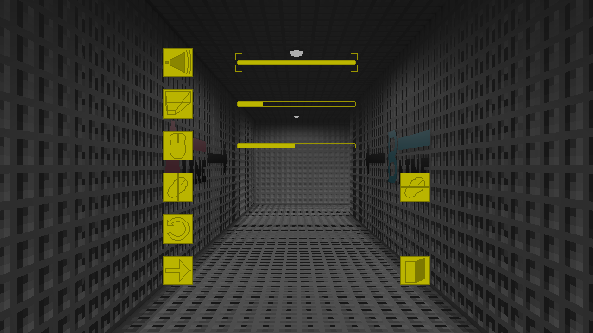
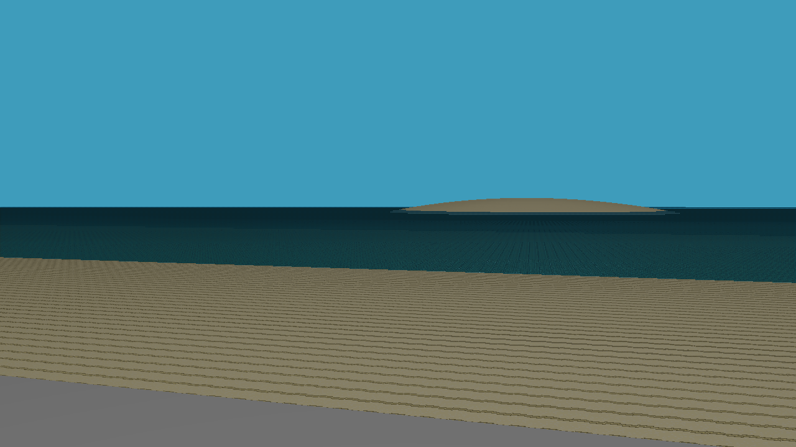
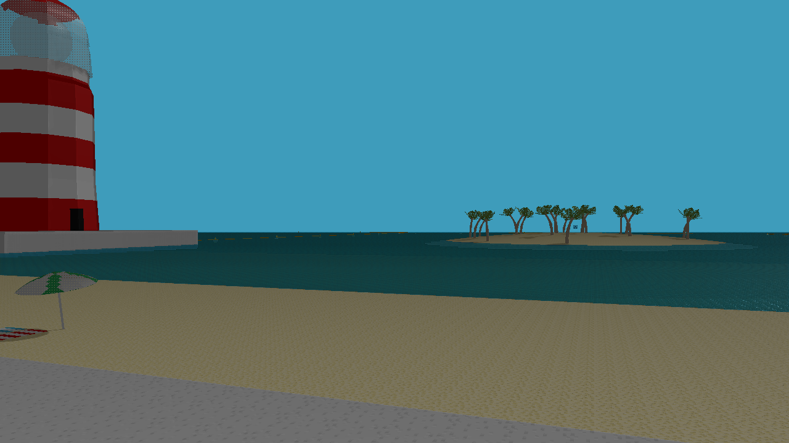

# B-Line - Post-Mortem
**B-Line** has been released on Steam on **October 3rd 2025**. It's a **short knowledge-based walking simulator** where the player explores different worlds to find how to get out of the station.

This article talks about the origins, development and results of the project.

## Origins and References
The project started **July 16th**, according to the project's folder's creation date, under the codename *Hell's Stations*, but the actual development started **October 3rd 2024**, which is exactly one year before the release. The game was supposed to release before the end of 2025, with around a year of development, but the fact that it released exactly one year after the start of the actual development is a coincidence and was actually discovered while working on this article.

The **baseline of the project**, as written in the project's notebook, laid in a few bullet points:
- Liminal Spaces
- Mystery Game
- Travel through sations to find hints on how to escape - Non-linear
- Can escape from the start if the solution is known

Unexpectedly, **these four points actually stayed until the release**, which is not the case for a lot of things that were written during "pre-production".

### Inspirations
This project has been inspired by **several works**, that include games and an anime.

The subway setup comes from [**The Exit 8**](https://store.steampowered.com/app/2653790/The_Exit_8/) by *KOTAKE CREATE*, a brilliant anomaly game, where you go through the same subway station multiple times in a row, and if something changed, you have to go back, but if everything is the same, you have to go forward. A really simple but effective pitch for an excellent game. A movie also released in 2025 and is a pretty nice watch.

*The Exit 8, Steam screenshot*

The idea to go through completely different worlds with the same subway line comes from [**Train to the End of the World**](https://www.crunchyroll.com/series/GXJHM3GNX/train-to-the-end-of-the-world), an anime by studio *EMT SQUARED* and based on the comedy manga written by *apogeego* where the 7G (yes, the cellular network technology) deployment completely distorted Japan and affected its inhabitants. It follows a group of girls that take the train to go to Ikebukuro to find their missing friend, as they will stop at different stations where the 7G deployment had different effects.

*Train to the End of the World, Key Visual*

The knowledge-based gameplay comes from [**Outer Wilds**](https://store.steampowered.com/app/753640/Outer_Wilds/) by *Mobius Digital*, even though I don't reference it when I talk about the game to people, as I feel like it would be insulting to compare B-Line to the masterpiece that is Outer Wilds. If you have not played it yet, you should, and I won't tell more about this game as it must be discovered blindly.

*Outer Wilds, Steam screenshot*

B-Line has multiple endings and secrets, this "layer" system is directly inspired by another excellent metroidbrainia, [**ANIMAL WELL**](https://store.steampowered.com/app/813230/ANIMAL_WELL/) by *Billy Basso*. I actually discovered and played ANIMAL WELL in July 2025, in the middle of B-Line's development, and yet, its influence on the gameplay has been great, and the reason why a game I discovered that late in B-Line's development period had a big influence will be explained later.

*ANIMAL WELL, Steam screenshot*

And these are the main inspirations for B-Line, some parts of the game are also inspired by **Tunic** or specific parts of games, like **The Legend of Zelda: Ocarina of Time**'s *Lost Woods* for the Forest station.

## B-Line's development
### Looking for the gameplay
B-Line has been designed **Top-Down**, which means that the main pitch of the game contained no gameplay but a setup, so the starting station and using the subway to go to different worlds. What would the game's goal be? **This question took months to answer** and many scrapped gameplay ideas were considered before finding the one the game shipped with.

The main question was: *What do we do in each station to go to the next one?* because at some points, the non-linearity of the game seemed too complicated to actually make, so the game was considered to be linear, with a clear objective on each station to go to the next one, until you finish the game. And with that in mind, the game was supposed to have 20 stations at first, but that was way **out of scope for a development time of around a year**, as each station was supposed to be completely different to every others, needed a goal and had to be game and level designed, textured, sound designed and programmed.

Having a linear game has a good commercial advantage as **you can "easily" make a demo out of it**, and it helps a lot with marketing on Steam. Making a demo for a non-linear game is way more complicated, you cannot just take the game at the middle of the development, use this as a demo and continue the development for the full release, you would have to make a completely different product just to show people what the full game will be about, it can consume both time and ideas.

So multiple ideas were considered for the gameplay, but none were satisfying enough to be chosen.

Then I decided to go back to my initial plan, make a non-linear game. As the game was supposed to release before the end of the year, I decided that not having a demo was okay, as the marketing time would be really short anyway, and as **the main goal of this project was to prove that I was able to make and publish a commercial game on Steam**, using my own game engine, it didn't need to be a commercial success anyway.

I wanted **controls to be as simple as possible**, with walking, looking and jumping as the only three possible actions, no interaction button for example. So all puzzles had to be designed around one or multiple of these gameplay elements.

**The game also has no text**, and there two reasons for this: First, I am terrible at writing interesting text, so having text into the game would have been more negative than anything, and second, no text means **no localisation** to do. I wanted the game to be played by everyone and thought that skipping the language barrier would be the best idea for it.

### Stations and level design
Having too many stations in this kind of game would make it too hard to solve and 20 stations was way more than I could make in this short time period, so I decided that the game would contain 10 and then 8 stations, not counting the initial one. The first few of them were already being worked on way before finding the gameplay, as I wanted to find a gameplay that would "work on every type of map", which made the gameplay research even harder.

I wanted **puzzles to be integrated into the stations** without being obvious, as "**environmental puzzles**". They are all around the player but as long as they don't know what to look for, they are basically invisible as they are part of the environment itself. It also made **adding more props into each world complicated, each element can be considered a hint or part of a puzzle, and I didn't think that confusing the player with random elements was a good idea**, but on another side, it also makes the maps seem empty.

Some puzzles can be randomly solved, but I designed them so the player doesn't randomly stumble into the solution, from a large number of combinations for the *Forest* puzzle to the *Museum* puzzle.

### Theme of the game
The theme of the game has been **decided when the project started**. At first, it was supposed to be more explicit, with elements on the map that were related to it, but I ultimately decided that it would not fit the ambience I wanted to give to the game.

I won't reveal what the game is talking about in this article, as **your own interpretation is more important than what I planned** when making this game, but there are still a few hints that can help you understand what I meant with it.

### Game engine
The game has been made with [**NutshellEngine**](https://www.team-nutshell.dev/nutshellengine/), which is also being developed by me.

In March 2025, I considered **NutshellEngine to be stable enough to pause its development to work full-time on B-Line**, but that was pretty naive. The games I made before with NutshellEngine were really small, non-commercial, and generally didn't take more than a week to develop. B-Line was really different on all these points.

During the development, **some parts of the engine's runtime needed optimization**, especially the physics engine's broadphase (the part that crudely detects what entities may be colliding, before using more complex formulas to precisely calculate the intersection between entities) and the graphics engine's shadowmaps, where the frustum culling has been generalized to also work with shadowmaps. New features were also needed, like Steamworks' integration for achievements, and many bugs have been fixed.

The engine's editor had a lot of changes too, especially quality-of-life ones, to make B-Line development as effective as possible.

*NutshellEngine's Editor, with B-Line's Beach station scene, Scripts' names are hidden*

**Was using a custom engine slower than using an already established one for B-Line?** I would say that no, when the development of B-Line actually started in October 2024, NutshellEngine was already two years old, and as I have a perfect knowledge of all my engine's features and limits, even if I had to work on the engine while working on the game, I would say that **it sped up the time of production**.

As I am more a game engine developer than a game developer, **B-Line has been a great opportunity to make NutshellEngine better than ever**.

## Marketing and numbers
I hate selling things so the pre-release marketing plan was simple: **do the bare minimum**. I just made two Reddit posts in communities that made sense and told the people that followed me on social networks that I was releasing a game on Steam. This, and Steam's "Upcoming" section allowed B-Line to get **73 wishlists** when the game released.

Post-release, I only posted the game on [*r/metroidbrainia*](https://www.reddit.com/r/metroidbrainia/) on Reddit following a suggestion from a friend, and I should have done it sooner, as they had a lot of important remarks about the game.

As of October 27th, the game sold 73 copies, with 9 refunds, which equals to 308$ gross revenues, or 240$ gross revenues less refunds and taxes. The game has 11 reviews and is 81% positive. With a budget of 0$ (alright, 100$ with the Steam fees), it makes the game profitable.

## Post-release support
As of October 27th, the game had **11 post-release updates**, fixing many types of issues.

### Settings menu
Earlier in this article, I talked about how **the game has no text**, and I thought I would accompany this with **no User Interface too**, but this idea has been pushed to the extreme and **the game released without a settings menu, which was a terrible idea**. During development, I only made B-Line for myself and completely ignored the fact that other people would maybe play this game, and that they don't use the same audio volume, sensitivity and preferred field of view as me. I started by "fixing" this by **using the launch command** to set the sensitivity or invert the mouse axes, but seeing how **players found it weird to not have a settings menu**, I had to make one quickly. It took a day to implement a settings menu that allowed players to change the volume, FOV, mouse sensitivity and invert mouse axes, but is a really welcomed change that should have been there since release. **The "no text" issue has been fixed by using images** to describe what each option does.

*B-Line's settings menu released in version 1.1.0*

### Sprint button
The sprint button is a **controversial topic**... During development, some playtesters asked for one, but **I decided and was adamant not to add it**, as the game was supposed to be slow, and **preferred to reduce the size of the biggest maps**, as I considered that the speed issue came from a distance issue. It didn't fix the issue at all, it just reduced it a little bit, the game was still too slow for players.

*The Beach's island was further and bigger during development. 1: April 1st, 2: October 27th*

What actually convinced me to actually do something about it was when I talked to a user on Reddit that actually played the game (all endings!) and during our conversation, they said that the thing they didn't like about it was the walking speed.

And by talking to some people, **I realised what the actual issue was**, and it was neither a speed or a distance issue: it was a **content issue**. The maps are small but pretty empty, as the puzzles are directly inserted into the environment, simply adding props here and there on each map would have been terrible for the player, as every element can become a hint. But **this lack of elements, and especially elements that tell *something*, makes the game feel slow**, as you basically go from point A to point B without anything that actually means something between these two points. In some walking simulators, "pointless" walking is often accompanied by a voice, like the character's voice or a narrator, telling you a story, as it can be the case in **Dear Esther** or **Stanley Parable**, but B-Line doesn't have this.

So what's the solution to fill the moments when you go from Point A to Point B? **Going there faster**.

But there is an issue with this solution: **the maps have been designed with the normal walking speed in mind**, especially for jumps. Instead of simply bumping the movement speed up, which was considered but showed terrible results as some moments that required precise walking became nearly impossible, a sprint button was added, which makes the player go nearly twice as fast as walking. Jumps aren't affected by the sprint speed though, as some maps rely on the original jump speed. It also makes the "*Deadline*" achievement way easier to get, which is fine, only 1 second to spare when walking was a little bit too hard anyway.

There is also a **psychological effect to a sprint button**, not having one is like not having a jump button in a first person game, it can make the player feel *chained*.

## Conclusion and what's next
B-Line's project is now over but there may be new patches to fix bugs.

I have an idea for another game of this type, using what I learned while working on B-Line, but I'm not sure it will actually happen as it is now time to find a real job.

If you are looking for, or know someone who is looking for a game engine developer and/or graphics programmer, please contact me on [my email address](mailto:contact@team-nutshell.dev)!

Overall, it has been a **pretty good experience**, I learned a lot on game and level design and I have been able to improve NutshellEngine greatly thanks to this, so I'm completely satisfied.

Thank you for reading this article and thank you for playing B-Line if you have!