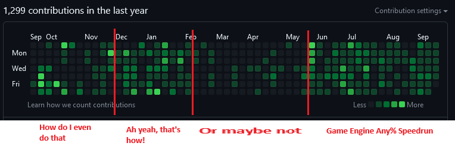
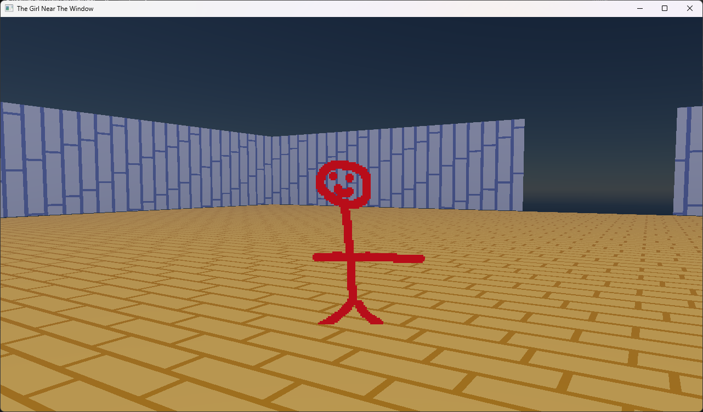
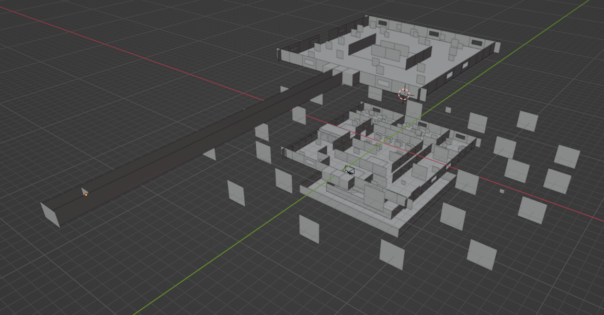
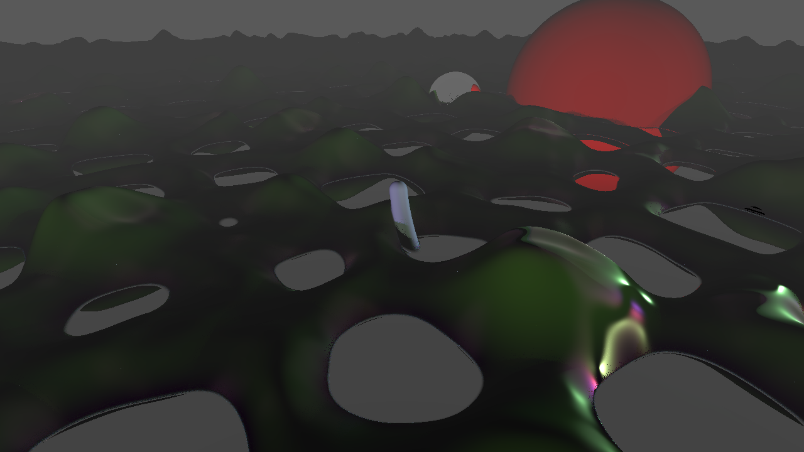

# NutshellEngine's 1st anniversary!

<iframe width="1280" height="720" src="https://www.youtube.com/embed/JVFEKWaqpMk" title="NutshellEngine 1st Anniversary Showcase" frameborder="0" allow="accelerometer; autoplay; clipboard-write; encrypted-media; gyroscope; picture-in-picture; web-share" allowfullscreen></iframe>

*NutshellEngine 1st Anniversary Showcase video (click to access it)*

Today marks the **first anniversary of NutshellEngine**, with the first repository, [NutshellEngine-Core](https://github.com/Team-Nutshell/NutshellEngine-Core), opened **September 23rd 2022**.

*GitHub commits, mostly on NutshellEngine, only takes the main branches in count*

NutshellEngine is my **biggest project to date**, and it's **not even the longest lasting at the moment**, as [NeigeEngine](https://github.com/ZaOniRinku/NeigeEngine) has been worked on for nearly two years (from July 2020 to May 2022). But even though NutshellEngine is only half its age, it's already way bigger than what NeigeEngine was, which **wouldn't have been possible if I hadn't worked on NeigeEngine before**.

NeigeEngine was great **for experimenting and learning**, which is also the case for NutshellEngine, it is the first reason why I decided to make a modular game engine: to be able to **fail and repeat easily** (more about this in the [Mistakes will be made](mistakes.md) article), which is, I feel, an important part in making a game engine while still learning how to do it. NeigeEngine was not really good at this, and with experience, some design choices didn't please me anymore, but changing them was way too complicated, so starting back from zero was needed.

**NeigeEngine was also not really good at... making games**. Which seems stupid for a game engine (and it is), but if you don't actually try to make a game, a completely standalone application, that you can play and share, chances are that the engine's architecture isn't even able to make games easily. Even worst, **I discovered that NeigeEngine couldn't actually make games way after the end of its development**, and after the NutshellEngine project started development.

## What is NutshellEngine?

NutshellEngine is a **game engine** made by **Team Nutshell** (it's called a "Team" but there is only me, ZaOniRinku, at the moment). This game engine is modular, which means that **it uses modules** to enable game developers and game engine developers to work together by putting all the technical parts (graphics engine, physics engine, audio system, window and inputs, assets loading) in modules that can be swapped without changing a single line of scripting code nor recompiling the game. That way, gameplay programmers can work on the game using some already-made modules (like the [ones available here](https://www.team-nutshell.dev/nutshellengine/modules/)) while the engine developers can work on the graphics or physics engine, for example, in parallel.

[Team Nutshell's website](https://www.team-nutshell.dev/nutshellengine/) contains more information.

## The Girl Near The Window
**The Girl Near The Window** is the **first game** made with NutshellEngine.

I really appreciate the aesthetic of **old 3D games** like DOOM, but at high resolution, and this is what started The Girl Near The Window.

I also really like making games that **use the window itself** (spoiler?). One of my previous game prototype was [Window Explorers](https://zaonirinku.itch.io/window-explorers), made with GameMaker Studio 2, where the player would open the game twice and connect them to each other over network. They could then move the characters (the little blue and red squares), which would move the window on the screen to show the map's layout.

<iframe width="1280" height="720" src="https://www.youtube.com/embed/9TRDOF6XXkc" title="Window Explorers" frameborder="0" allow="accelerometer; autoplay; clipboard-write; encrypted-media; gyroscope; picture-in-picture; web-share" allowfullscreen></iframe>

*Window Explorers, made with GameMaker Studio 2*

I also made [another game prototype](https://twitter.com/ZaOniRinku/status/1441115827416092679) where a window would be a character, and [other windows would be platforms and obstacles](https://twitter.com/ZaOniRinku/status/1452666974366994445).

The Girl Near The Window would follow this idea to **use the actual window as a gameplay mechanic** (which is not a good idea if you want to make games for consoles).

At first, it was supposed to be a project to test if making games with NutshellEngine was difficult, **only 4 months after the start of the development**, which was quite ambitious and especially optimistic.

And difficult it was, with no scene management and file format, and no real asset loading, making a game required to code the entire scene, which is really tedious. So I decided to abandon the idea to make it on NutshellEngine and actually make it on NeigeEngine. Which is where I discovered that **it was actually not really possible to make standalone games on NeigeEngine**.

*The Girl Near The Window on NeigeEngine*

So I then decided to abandon the project completely... Which is actually not true, as I decided I would actually do it on NutshellEngine anyway, even if it would be difficult, it would actually show me where the difficulties are, what needs improvements, what is missing, etc. A crucial part when making a game engine, that never happened while working on NeigeEngine.

Project development started **January 17th 2023**, with the first version releasing **January 27th 2023**, so only **10 days of development**.

This first version would not launch on computers equipped with an AMD GPU, but this issue was quickly fixed.

The main.cpp of this project is absolutely atrocious, as **the entire scene is written in it**. And not only the scene, but **the assets too**, as the engine lacked the ability to load assets from files, models, images and sounds were written directly, byte per byte, into the main.cpp file. Visual Studio does not really appreciate this by the way, as passing the cursor on these would freeze it for seconds. Blender was used to design the scene and objects' coordinates were copied by hand into the main.cpp file.

*The map from The Girl Near The Window, in Blender*

But even though the development was chaotic (for only 10 days, which is fine, I guess), [the game released](https://zaonirinku.itch.io/the-girl-near-the-window)! And even more surprising, some people actually played it, with only two players reporting an issue (one of them was the AMD GPU issue and the other one heard coil whine coming from their GPU, which *probably* came from the fact that the game was not frame limited, and not CPU intensive, which means that the GPU was running at 100% capacity to produce thousands of frames per second).

*The Girl Near The Window on NutshellEngine*

I now knew that **making a game on NutshellEngine was possible**, *tedious*, but possible. I knew where the issues were so I could start working on fixing this.

## Global Game Jam 2023
The second game would come way quiker than I expected, as the [**Global Game Jam**](https://globalgamejam.org/2023/games) was coming just 2 weeks after The Girl Near The Window's first release (from February 3rd to February 5th where I did it). I **don't do gamejams often** (or even, never, only did a single gamejam before this one) but it was the occasion to try to use NutshellEngine during an even shorter timeframe, 48 hours.

For this gamejam, I didn't want to do the same graphics as The Girl Near The Window, and I am not good enough at Blender to make my own 3D models, especially if I have only 48 hours to make an entire game. So I decided to go with **raymarching**. I love writing shaders and raymarching is not an issue for me, so that was a pretty good choice for a gamejam.

I made [The Origin of Light](https://zaonirinku.itch.io/the-origin-of-light-ggj-2023) during this gamejam. Performance were absolutely terrible, which is not the engine's fault, as the entire graphics run on a single raymarching fragment shader, where I did not optimize the signed distance field calculations, but it was playable at low resolution.

*The Origin of Light*

## Taking a break
The most keen-eyed readers will notice that **there was not a lot of commits** on my GitHub account between around the end of the Global Game Jam and the end of May. The reason is simple: working on NutshellEngine became **exhausting**, especially because of a huge mistake I did when starting the project (more on that later). During this period, I started to work on [Team Nutshell's website](https://www.team-nutshell.dev/) (which is where you're probably reading this article). I am no web developer so I just used GitHub Pages and made [a custom CSS](https://github.com/ZaOniRinku/GitHubPagesDefaultThemeDark). I also learned about WebGPU and started experimenting with it in C++ (even making a [graphics module for NutshellEngine](https://github.com/Team-Nutshell/NutshellEngine-GraphicsModule/tree/module/webgpu-triangle)) and TypeScript (made a [WGSL shader editor](https://www.team-nutshell.dev/shader/editor.html) and a [simple model viewer](https://www.team-nutshell.dev/model/visualizer.html)), did not like it and moved on (wrote [an article about this in french](https://zaonirinku.github.io/other/webgpu.html)).

Before that break, I was working on NutshellEngine way too much because I **really liked working on this project** and you can **never get bored from working on a game engine**, as there are so many things to learn and do.

Obviously, **this could not be sustainable on the long run**, so I decided to put a little less time on it.

## Public presentation
In my city, every month, **the video game developers association organize a meetup**, where people can talk about how they're going, their current projects, etc. and someone makes a presentation about a topic of their choice.

At **the end of March**, I did a presentation about **independent game engines development**, to explain the principle, why people would do that, how to start working on it, etc. At the end of it, I talked about my personal projects, including NutshellEngine, and the **ETA for version 1.0**, that I basically estimated **in at least 1 and a half year from there** (optimistically), as there were still many things to do for it to be actually usable.

## The biggest mistake (to date!)
NutshellEngine is split on multiple repositories. There is one for [the applications made with the engine](https://github.com/Team-Nutshell/NutshellEngine-Application), one for [the engine's core](https://github.com/Team-Nutshell/NutshellEngine-Core), one for [the common resources](https://github.com/Team-Nutshell/NutshellEngine-Common), one for [the modules' common resources](https://github.com/Team-Nutshell/NutshellEngine-Module) and one of for each type of module. The reason for this structure is to have a branch per module, to be able to switch easily between them.

This structure has not been an issue, **but** the way the core, applications and modules **accessed the common resources** (NutshellEngine-Common and NutshellEngine-Modules) was absolutely terrible.

I decided, at first, to use [**Git Submodules**](https://git-scm.com/book/en/v2/Git-Tools-Submodules), which allow to "embed" another repository in a repository. This way, I could put the common repositories directly in each repository that needs them. And it was a good idea at first! I could update them with a command without having to manually copy and paste the content of the common directories.

It was actually **the biggest mistake and the worst decision I made for NutshellEngine**. As I explained, each module type got its own repository and got branches for the modules themselves. But then, what happens when you start to have a *lot* of modules? You have to update them when you update the common resources (if they use something that has been changed). This implied to update the common submodules too, for each branch, which took way too much time each time I made an update (and I used a shell script to automate this!), and there were **a lot of updates and breaking changes**, which are pretty common in the early stages of a game engine development.

At the middle of June, I decided to **completely ditch the submodules** to pass the common resources directories via CMake, and if there is none, download the last commit from the main branch on GitHub using the [FetchContent](https://cmake.org/cmake/help/latest/module/FetchContent.html) CMake command. It has been the best decision I've made as development went really fast after that.

My conclusion from this experience is: never use git submodules, there are better alternatives, always.

## Work-work balance
Also at the middle of June started my new job. Being a full-time job, NutshellEngine's development should have been negatively impacted by the lack of time.

Paradoxically, it is also when NutshellEngine's development sped up a lot, and I can identify two reasons. First, the **biggest mistake has been fixed**, allowing me to work way more efficiently, and second, the pause allowed me to **take a step back from the project**.

NutshellEngine's development now happened each working day, from the evening, and the week-end. It's not a good work rhythm at all, it's even more exhausting than before but seeing the project progress fast is motivating me to continue working on it.

The first few months after starting this new job, NutshellEngine received:
- A proper [physics module](https://github.com/Team-Nutshell/NutshellEngine-PhysicsModule/tree/module/euler) that actually does physics things like collisions detection and response, impulse, raycasting, etc. The Girl Near The Window had a simple collision detection system that just cancelled the movement if the camera entered into a wall (it's also used as a game mechanic),
- A job system for multithreading,
- Networking with Windows and Linux sockets,
- The first User Interface drawing functions in the graphics modules,
- A rework for the assets management, allowing to create modules to load more types of assets,
- Custom file formats to define scenes, materials, and more (finally being able to define a scene without writing it manually in main.cpp and having to recompile the application each time is really great),
- A scripting API for easier scripts development,
- An audio rework to split the concept of sounds (basically, a sound file) and sound sources (instances of a sound that can be played at the same time) and adding positional audio,
- A [first documentation](https://www.team-nutshell.dev/nutshellengine-docs/), not the greatest but a good base to progress from,
- Many other things like putting a mathematics library directly into the engine, a JSON reader and writer, gamepad inputs, etc.

## So, what now?
I went way further than I expected in this one-year timeframe. The biggest objective at the moment is the **GUI Editor** allowing to place objects in a scene, create materials, etc. Basically, a graphical interface to make games without having to edit the JSON files by hand, as it is being done now.

I also want to make another game, now that the engine has way more features than what it had when The Girl Near The Window was in development.

In general, I still got some features to implement to consider the engine in its "1.0 state", such as:
- Custom renderer functions, which include:
	- Functions to draw a mesh, text or shape in world-space (it's only available for UI at the moment),
	- Custom shaders in [materials](https://www.team-nutshell.dev/nutshellengine-docs/types/Material/), which asks an important question: Which shader language to chose? NutshellEngine modules' implementations are defined by the module's programmer, so materials' shaders will need a transpiling phase to go from NutshellEngine's shader language to the module's API's shader language and format. Three options are being considered:
		- A custom shader langugage: Probably not the right way, as it is really hard to design a good programming language and there is no real need for another shader language. It is probably better to chose an already well-established shader language and give tools to write shaders easily (like a GUI node system).
		- GLSL: A well-known language, easy for beginners, supported by OpenGL with a good SPIR-V compiler for Vulkan, but will need a high transpiling phase to HLSL for Direct X.
		- HLSL: Another well-known language, supported by Direct X, with a pretty good SPIR-V compiler for Vulkan, but will need a high transpiling phase to GLSL for Direct X. Has more functionality than GLSL and is used in more productions.
- Torque and collision rotation on physics. It can be part of NutshellEngine from now but I want to implement everything I add in the engine in one of the module to be sure that the design I chose actually works. It is probably what's coming first.
- Mini scripting rework:
	- Completely splitting the engine's runtime and the scripts. That would allow games to only be a folder with scripts and assets and a pre-built binary that would be the same for all games.
	- Accessing other entity's script's public variables from the scene file. It's already possible to read and write them from a script but not possible to edit them from the scene file yet. It's way easier to test some things when you don't have to recompile the application and can simply edit a few values in a JSON.
- Custom modules functions. To make module developers more free on their implementations, I thought about a way to communicate data via custom messages between script and module, and module and module. The design is already done but this feature, while really interesting for gameplay and module developers, will cause issues when using other modules than the one intended, as these other modules won't understand the data sent to them from the scripts and other modules.

It's not 100% sure that all these features will make it to 1.0 but many more not written there will be added too.

To conclude this article, I am really happy with how the engine is progressing after a year and I am finally going to start re-doing games with it.