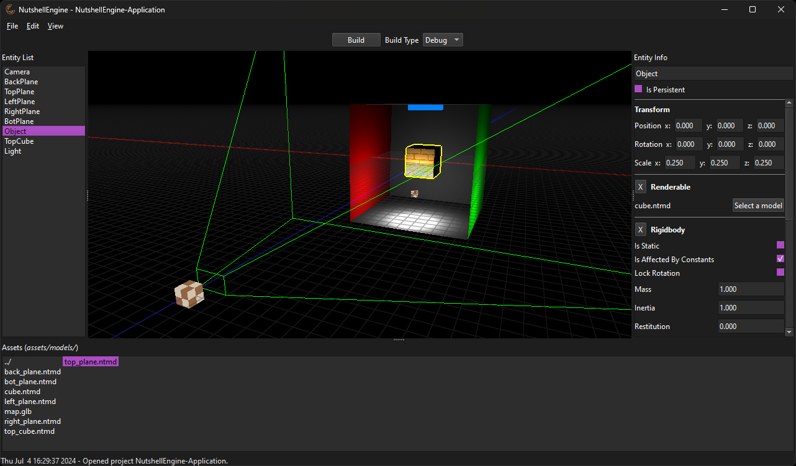
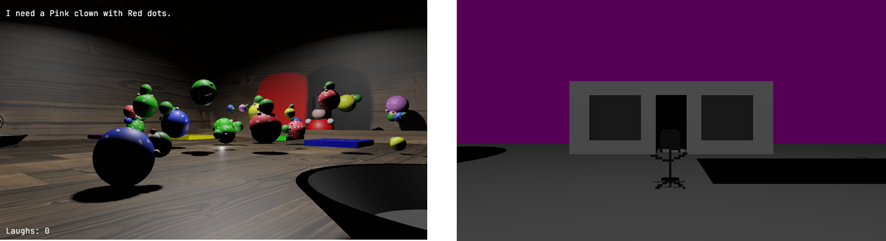
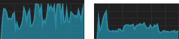

# NutshellEngine's 1st release!

NutshellEngine is now in development since nearly 2 years and today marks **the first public release of the engine**!

The first release is available on **both Windows and Linux** on [itch.io](https://team-nutshell.itch.io/nutshellengine).

I've used this engine to make games since 4 months after its development started but I never considered it ready for the public **until now**. Being open-source, it was technically always possible to use NutshellEngine but **you had to compile everything yourself**, which is definitely not adapted to a "public release".

Being so close to the **second anniversary in September**, this article will serve as a sequel to the [first anniversary](1stanniversary.md) one, so it will talk about what happened between the first anniversary and now.

## "So, what now?"
I ended the [first anniversary](1stanniversary.md) article with a "So, what now?" section talking about my ideas for the future of NutshellEngine, so nearly one year later, let's see if what I wanted to do actually happened:
- **the GUI Editor**: I didn't think it would, but yes, it's done! I talk a lot about how I designed and developed it [in this article](first-editor.md).

*NutshellEngine's editor*

- **Making another game**: Yes! Two actually, the first, [**Make Me Laugh - Clown Shop**](https://ntsh-oni.itch.io/make-me-laugh-clown-shop-ggj24), made with friends during **Global GameJam 2024** and the second is the sequel of the first game made with NutshellEngine, [**The Girl Near The Window 2**](https://ntsh-oni.itch.io/the-girl-near-the-window-2), released April 6th 2024. Based on the same idea as **The Girl Near The Window** but with different gameplay elements, it has been made with the editor in its primal form.

*Make Me Laugh: Clown Shop & The Girl Near The Window 2*

- **Functions to draw a mesh, text or shape in world-space**: It's still not here, I still haven't find a good way design for this feature.
- **Custom shaders in materials**: Still not here too, but the design of the feature is mostly done.
- **Torque and collision rotation on physics**: It's done! Entities can now roll when they have to.
- **Mini scripting rework**: It was actually not that *mini* but it's done, instead of compiling the scripts with the engine's runtime, **the scripts are now in a dynamic library while the engine's runtime is the executable**, and is the same executable for all games running on the same version of the engine. It's not yet possible to specify values for scripts variables in the scene file (and editor) but it's still being designed.
- **Custom modules functions**: What was supposed to be pretty easy to design actually opens more questions, especially on divergence inside applications, as you would be able to call custom modules functions that don't exist in some modules. It's not abandoned but it needs more thinking.

So, is it this "1.0 state" I was talking about in the first anniversary article? I think it is, and yet, this first release is not called "1.0", I think version numbers aren't really important so it's going to be "0.0.1" until I decide to change it.

## Even more
This year, I didn't only do what was described in the first anniversary article, so here's a list of non-exhaustive things that were also added to the engine:
- **Better physics**: Not perfect but the physics API has been improved and the first module implementation, [Euler](https://github.com/Team-Nutshell/NutshellEngine-PhysicsModule/tree/module/euler), is also way better.
- **Profiler**: A profiling class has been added to add profiling blocks into modules or scripts, helps to detect performance bottlenecks.
- **Asset management rework**: Asset loader modules couldn't call the AssetManager, so it was harder to load assets contained in assets (like textures in model files), now they can.
- **Size reduction**: A huge [Common](https://github.com/Team-Nutshell/NutshellEngine-Common) and [Core](https://github.com/Team-Nutshell/NutshellEngine) rework moved nearly all Common implementations into Core, slightly growing the runtime's executable size, but massively reducing the modules and scripts library sizes. In the end, a NutshellEngine application weights way less than before.
- **Wait between two frames rework**: To block the number of frames per second, I used to busy wait all the way, causing the CPU core to reach 100% usage. It's now done with an hybrid sleep/busy-wait method, reducing the usage to around 20%.

*CPU usage before and after Wait between two frames rework*

- **Many modules improvements**: Modules have been worked on a lot to have better performance and better features.

## Reflecting on the release and what's next
I don't expect anyone to actually try and use NutshellEngine, but I will work on it as if people actually use it, because I'm using it myself. This means, **bugfixes and improvements** to both the runtime and the editor, **better documentation** with examples and tutorials on how to make a game with NutshellEngine and **actually make more games with NutshellEngine**.