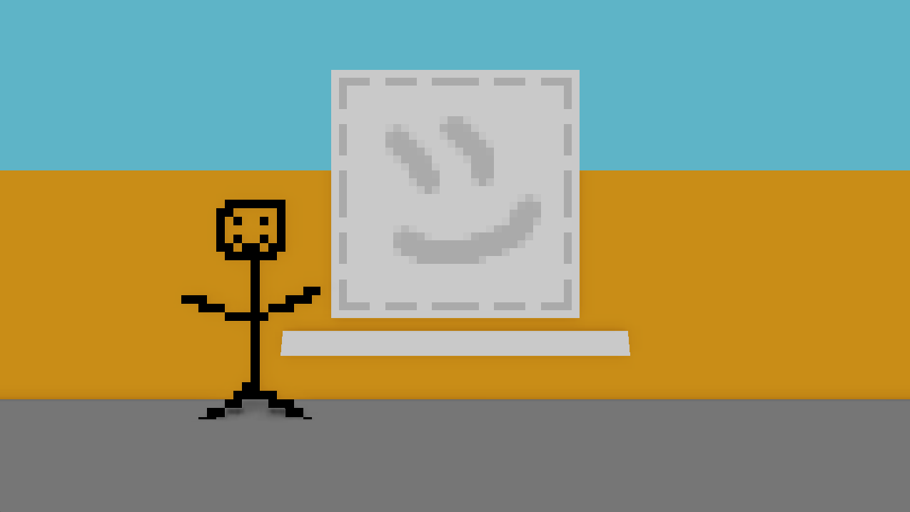

# NutshellEngine's 3rd anniversary!

Today is NutshellEngine's 3rd anniversary!

## What happened this year
This year, NutshellEngine got [https://team-nutshell.itch.io/nutshellengine/devlog](**17 releases**) (0.1.1 - 0.2.0).

A lot of things were added and changed, here is a small sample:
- **UI/UX editor improvements**: With the goal to make the engine more and more accessible, the editor needs a lot of work. It's now possible to duplicate and rename entities and assets easily and quickly, guizmos can keep the same size independently of the distance to the camera if the option is selected, etc.

- **Particles** have been added, with different parameters (duration, size, speed, rotation, direction, etc.) and the possibility to use an image.

*Particles, with NutshellEngine's logo on it*

- **Optimizations on the runtime**, examples include shadowmaps that now use frustum culling to reduce the number of draw calls and various optimizations for the broadphase of collision detections.

- **Text rework**, with the addition of SDF fonts, to allow for better scaling.

*Up: Bitmap fonts, Down: SDF fonts*

- An **Entity Group system**, as the engine doesn't use hierarchical scenes, *Entity Groups* is a way to have entities in a same group and get all entities belonging to a group easily in a script. It can allow, for examples, to define a material for ground entities (like *Grass*, *Sand*, etc.) to adapt the footstep sound to play, have all entities that must play an animation at the same time in a group, or simply tag entities (is it a *Projectile*, an *Enemy*, etc.). *Entity Groups* are just strings that you give to entities.

- **Triplanar Mapping** allows to quickly tile textures when making big surfaces with small textures. It's an extremely quick and effective way to create environments and its addition to NutshellEngine has helped a lot with game development.

*Left: Triplanar Mapping, Right: UV Mapping*

- **Better Script debugging**. NutshellEngine used to silently crash when a Script had an issue. Now, if the game is launched through the editor, it will show where the error is.

*Left: The script that causes the issue, Right: The error message*

- **Steam integration**, or more generally **Platform integration** but Steam is the only implementation at the moment. The new **Platform Module** allows to interface with distribution platforms, such as Steam, to enable achievements, fetch the friend list, etc.

## What about games?
During this year, **four games** have been made with NutshellEngine, with one of them made, as usual, during **Global Game Jam**.

All these games have been made by me, generally solo but sometimes with friends.

[**The Perfect Picture**](https://ntsh-oni.itch.io/the-perfect-picture) has been made in January 2025 and is a game where you have to drag-and-drop images to find the perfect image that will please the jury.

[**Comfort Bubble**](https://ntsh-oni.itch.io/comfort-bubble) has been made **during a weekend** for Global Game Jam 2025 (January 24th to January 26th, with the theme *Bubble*). It's a platformer where you have to stay in your bubble to avoid losing HP, but there is a twist...

[**Backface Climbing**](https://ntsh-oni.itch.io/backface-climbing-ugej) has been made during the Unconventional Game Engine Jam from February 23rd to March 2nd with the theme *Backward*. It's a platformer where only the backfaces of meshes are rendered.

[**Back Ward Fort**](https://ntsh-oni.itch.io/back-ward-fort-ugej) has also been made during the Unconventional Game Engine Jam with the theme *Backward*. It's also a platformer where you have to enter and trap yourself into a fort instead of escaping it.

But also...

## Soon a first game on Steam!

The **first NutshellEngine game to come to Steam**!

It's made by me and it's called **B-Line**. It's a walking simulator where you have to explore different environments that you access via the **B-Line subway** to find out how to escape the station.

It's releasing **October 3rd 2025** and I'm really happy with the result.

<iframe src="https://store.steampowered.com/widget/3939010/" frameborder="0" width="646" height="190"></iframe>

## Conclusion

I would say that this year has been as productive as the two previous ones so I'm happy with how the engine is going. I still have no idea when the "1.0" update will release, getting to this specific state is a pretty long process, even if it doesn't really mean anything.