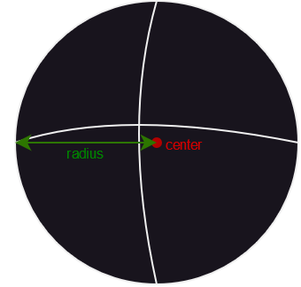
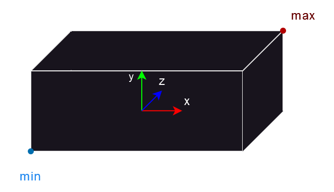
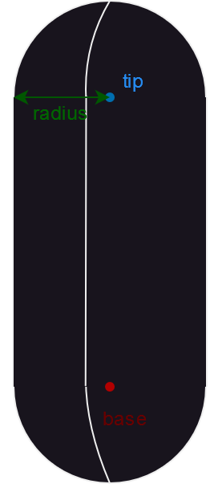
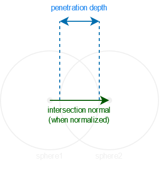
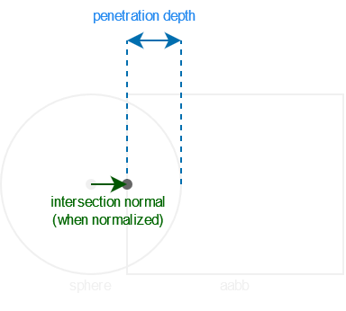
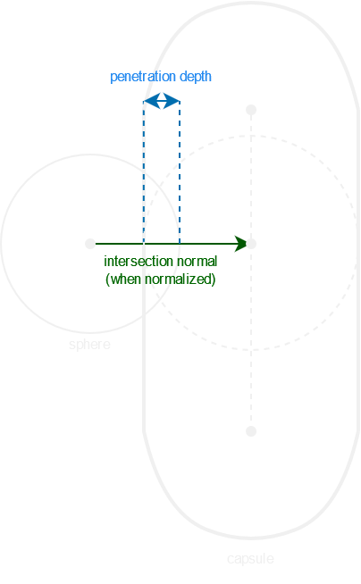
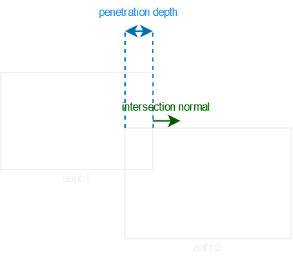
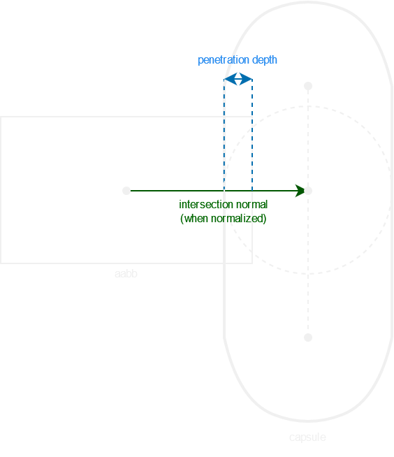
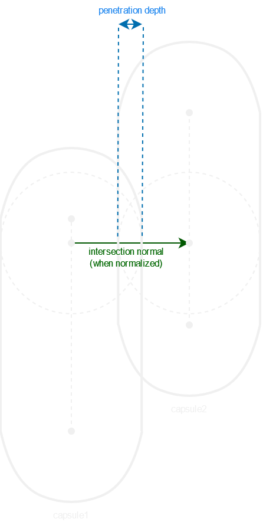

# Colliders, intersection normal and penetration depth
If you are making a physics engine, you may need to considerate some simple shapes as colliders and a way to find if these shapes are intersecting.

While developing a first [**physics module**](https://github.com/Team-Nutshell/NutshellEngine-PhysicsModule/tree/module/euler) for NutshellEngine, three shapes were chosen: **sphere**, **AABB** and **capsules**.

## Shapes

### Sphere


```cpp
struct Sphere {
	vec3 center;
	float radius;
};
```

The sphere is generally used to represent balls, bullets or little objects. It is composed of a center and a radius.

### AABB


```cpp
struct AABB {
	vec3 min;
	vec3 max;
};
```

The AABB is generally used to represent walls, floor and big obstacles. Being axis-aligned, it can be represented using only the minimum and maximum on each axis.

If ``m`` is the minimum in an axis and ``M`` is the maximum in an axis (for example, ``mMm`` means minimum on ``x``, maximum on ``y`` and minimum on ``z``), the 8 corners of an AABB are: ``mmm``, ``mmM``, ``mMm``, ``mMM``, ``Mmm``, ``MmM``, ``MMm`` and ``MMM``. ``min`` and ``max`` are respectively ``mmm`` and ``MMM``.

### Capsule


```cpp
struct Capsule {
	vec3 base;
	vec3 tip;
	float radius;
};
```

The capsule, or **swept sphere**, is generally used to represent characters. It is composed of two points being the base and tip of the capsule and a constant radius along the base-tip segment. Capsules are particularly interesting because it can be seen as an infinity of spheres along the base-tip segment, which means that as long as we find a fitting point in this base-tip segment, the capsule-something intersection becomes a sphere-something intersection, with this point on the base-tip segment being the sphere's center and the capsule's radius being the sphere's radius.

We can find this point on the capsule's base-tip segment:

```cpp
vec3 closestPointOnSegment(vec3 p, vec3 a, vec3 b) {
	vec3 ab = b - a;
	vec3 ap = p - a;

	float e = dot(ap, ab) / dot(ab, ab);

	return a + (min(max(e, 0.0), 1.0) * ab);
}
```

This function returns the point on the ``a``-``b`` segment which is the closest to point ``p``.

## Intersection
Each of these shapes can potentially intersect with the same shape or any other so a way to check if two shapes are intersecting is needed.

Detecting a collision by returning a boolean telling if two objects interect is a good start, and can allow you to stop two objects from passing through each other, but it won't be enough for a physics engine, as you want a collision response between the two objects.

This collision response requires two elements: an **intersection normal** and a **penetration depth**.

```cpp
struct IntersectionInformation {
	bool hasIntersected = false;
	vec3 intersectionNormal = vec3(0.0f, 0.0f, 0.0f);
	float penetrationDepth = 0.0f;
};
```

The intersection normal is used to find the direction where an object is going to go after a collision and the penetration depth is used to move the objects out of each other.

In this article, the intersection normal goes from the first object to the second object, which means that its direction needs to be inverted (-intersectionNormal) when using it with the first object.

### Sphere - Sphere


Two spheres are intersecting when the distance between their centers is inferior to the sum of their radiuses. We also want to check if this difference is not null, as it would cause a NaN intersection normal during the normalization (as a reminder, the normalization of v is ``v / length(v)``, if ``length(v)`` is equal to 0.0, then it would perform a division by zero, resulting in NaN).

The intersection normal is the unit vector from the first sphere's center to the second sphere's center, and the penetration depth is the sum of their radiuses minus the distance between their centers.

```cpp
IntersectionInformation intersect(Sphere sphere1, Sphere sphere2) {
	IntersectionInformation intersectionInformation;

	vec3 centerDiff = sphere2.center - sphere1.center;
	float centerDiffLength = centerDiff.length();

	if ((centerDiffLength < 0.000001f) || (centerDiffLength >= (sphere1.radius + sphere2.radius))) {
		intersectionInformation.hasIntersected = false;
		
		return intersectionInformation;
	}

	intersectionInformation.hasIntersected = true;
	intersectionInformation.intersectionNormal = normalize(centerDiff);
	intersectionInformation.penetrationDepth = (sphere1.radius + sphere2.radius) - centerDiffLength;

	return intersectionInformation;
}
```

### Sphere - AABB


To find the intersection between a sphere and an AABB, you can project the sphere's center to the AABB, if this point is inside the sphere (indicated by its distance to the sphere's center being less than the radius of the sphere), then there is an intersection. If the center of the sphere is on the AABB's bounds, this distance will be null so we should not compute an intersection normal from this projected point as it will result in a NaN.

The intersection normal is the normalized vector going from the sphere's center to this projected point, and the penetration depth is the difference between the sphere's radius and the distance of this projected point to the sphere's center.

```cpp
IntersectionInformation intersect(Sphere sphere, AABB aabb) {
	IntersectionInformation intersectionInformation;

	float x = max(aabb.min.x, min(sphere.center.x, aabb.max.x));
	float y = max(aabb.min.y, min(sphere.center.y, aabb.max.y));
	float z = max(aabb.min.z, min(sphere.center.z, aabb.max.z));

	float distance = sqrt((x - sphere.center.x) * (x - sphere.center.x) +
	(y - sphere.center.y) * (y - sphere.center.y) +
	(z - sphere.center.z) * (z - sphere.center.z));

	if ((distance < 0.000001f) || (distance >= sphere.radius)) {
		intersectionInformation.hasIntersected = false;
		
		return intersectionInformation;
	}

	intersectionInformation.hasIntersected = true;
	intersectionInformation.intersectionNormal = normalize(vec3(x, y, z) - sphere.center);
	intersectionInformation.penetrationDepth = sphere.radius - distance;

	return intersectionInformation;
}
```

### Sphere - Capsule


The capsule being an infinity of spheres along the base-tip segment, to find the intersection between a sphere and capsule, we must find the point on the base-tip segment which is the closest to the sphere, then use this point as a new sphere's center and perform a sphere-sphere intersection<sup>[3]</sup>.

```cpp
IntersectionInformation intersect(Sphere sphere, Capsule capsule) {
	IntersectionInformation intersectionInformation;

	vec3 closestPointOnCapsule = closestPointOnSegment(sphere.center, capsule.base, capsule.tip);

	Sphere sphereFromCapsule;
	sphereFromCapsule.center = closestPointOnCapsule;
	sphereFromCapsule.radius = capsule.radius;

	return intersect(sphere, sphereFromCapsule);
}
```

### AABB - AABB


Two AABB intersect if all these statements are true:
- ``aabb1.min.x <= aabb2.max.x``
- ``aabb1.max.x >= aabb2.min.x``
- ``aabb1.min.y <= aabb2.max.y``
- ``aabb1.max.y >= aabb2.min.y``
- ``aabb1.min.z <= aabb2.max.z``
- ``aabb1.max.z >= aabb2.min.z``

To get the intersection normal and penetration depth, we must find the side penetrating the other aabb the least. We can then use this side's normal as the intersection normal and this distance as the penetration depth<sup>[2][4]</sup>.

```cpp
IntersectionInformation intersect(AABB aabb1, AABB aabb2) {
	IntersectionInformation intersectionInformation;

	vec3 normals[6] = {
		{ -1.0f, 0.0f, 0.0f },
		{ 1.0f, 0.0f, 0.0f },
		{ 0.0f, -1.0f, 0.0f },
		{ 0.0f, 1.0f, 0.0f },
		{ 0.0f, 0.0f, -1.0f },
		{ 0.0f, 0.0f, 1.0f }
	};

	float distances[6] = {
		aabb2.max.x - aabb1.min.x,
		aabb1.max.x - aabb2.min.x,
		aabb2.max.y - aabb1.min.y,
		aabb1.max.y - aabb2.min.y,
		aabb2.max.z - aabb1.min.z,
		aabb1.max.z - aabb2.min.z
	};

	int collidedFace = 0;

	for (int i = 0; i < 6; i++) {
		if (distances[i] <= 0.0f) {
			intersectionInformation.hasIntersected = false;

			return intersectionInformation;
		}

		if (distances[i] < distances[collidedFace]) {
			collidedFace = i;
		}
	}

	intersectionInformation.hasIntersected = true;
	intersectionInformation.intersectionNormal = normals[collidedFace];
	intersectionInformation.penetrationDepth = distances[collidedFace];

	return intersectionInformation;
}
```

### AABB - Capsule


The capsule being an infinity of spheres along the base-tip segment, to find the intersection between an AABB and capsule, we must find the point on the base-tip segment which is the closest to the AABB's center, then use this point as a new sphere's center and perform a aabb-sphere intersection.

```cpp
IntersectionInformation intersect(AABB aabb, Capsule capsule) {
	IntersectionInformation intersectionInformation;
	
	vec3 aabbCenter = (aabb.min + aabb.max) / 2.0f;

	vec3 closestPointOnCapsule = closestPointOnSegment(aabbCenter, capsule.base, capsule.tip);

	Sphere sphereFromCapsule;
	sphereFromCapsule.center = closestPointOnCapsule;
	sphereFromCapsule.radius = capsule.radius;

	return intersect(aabb, sphereFromCapsule);
}
```

### Capsule - Capsule


The capsules being an infinity of spheres along the base-tip segment, to find the intersection between two capsules, we must find the closest points on both base-tip segments, then use these points as new spheres' centers and perform a sphere-sphere intersection.

We will need a function to find the closest points on each segment<sup>[1]</sup>:

```cpp
pair<vec3, vec3> closestPointSegmentSegment(vec3 segmentA1, vec3 segmentA2, vec3 segmentB1, vec3 segmentB2) {
	vec3 segmentA = segmentA2 - segmentA1;
	vec3 segmentB = segmentB2 - segmentB1;
	vec3 r = segmentA1 - segmentB2;
	float segmentASqLength = dot(segmentA, segmentA);
	float segmentBSqLength = dot(segmentB, segmentB);
	float f = dot(segmentB, r);

	float s = 0.0f;
	float t = 0.0f;

	if ((segmentASqLength <= 0.000001f) && (segmentBSqLength <= 0.000001f)) {
		return { segmentA1, segmentB1 };
	}

	if (segmentASqLength <= 0.000001f) {
		s = 0.0f;
		t = clamp(f / segmentBSqLength, 0.0f, 1.0f);
	}
	else {
		float c = dot(segmentA, r);

		if (segmentBSqLength <= 0.000001f) {
			t = 0.0f;
			s = clamp(-c / segmentASqLength, 0.0f, 1.0f);
		}
		else {
			float b = dot(segmentA, segmentB);

			float denom = (segmentASqLength * segmentBSqLength) - (b * b);
			if (denom != 0.0f) {
				s = clamp(((b * f) - (c * segmentBSqLength)) / denom, 0.0f, 1.0f);
			}
			else {
				s = 0.0f;
			}

			t = ((b * s) + f) / segmentBSqLength;
			if (t < 0.0f) {
				t = 0.0f;
				s = clamp(-c / segmentASqLength, 0.0f, 1.0f);
			}
			else if (t > 1.0f) {
				t = 1.0f;
				s = clamp((b - c) / segmentASqLength, 0.0f, 1.0f);
			}
		}
	}

	return { segmentA1 + (segmentA * s), segmentB1 + (segmentB * t) };
}
```

```cpp
IntersectionInformation intersect(Capsule capsule1, Capsule capsule2) {
	IntersectionInformation intersectionInformation;

	pair<vec3> bestOnCapsules = closestPointSegmentSegment(capsule1.base, capsule1.tip, capsule2.base, capsule2.tip);

	Sphere sphereFromCapsule1;
	sphereFromCapsule1.center = bestOnCapsules.first;
	sphereFromCapsule1.radius = capsule1.radius;

	Sphere sphereFromCapsule2;
	sphereFromCapsule2.center = bestOnCapsules.second;
	sphereFromCapsule2.radius = capsule2.radius;

	return intersect(sphereFromCapsule1, sphereFromCapsule2);
}
```

## Conclusion
With these algorithms, an integrator and a collision reponse system, you can now make objects collide.

<video src="https://cdn.discordapp.com/attachments/952969158499385419/1123298433613180968/collisions.mp4" controls></video>

## References
- <sup>1</sup>[**Real-Time Collision Detection - Christer Ericson**](https://realtimecollisiondetection.net/)
- <sup>2</sup>[**Collision Detection - Newcastle University**](https://research.ncl.ac.uk/game/mastersdegree/gametechnologies/physicstutorials/4collisiondetection/Physics%20-%20Collision%20Detection.pdf)
- <sup>3</sup>[**Capsule Collision Detection - Wicked Engine**](https://wickedengine.net/2020/04/26/capsule-collision-detection/)
- <sup>4</sup>[**Platform game collision detection (Answer to a forum post) - oliii**](https://www.gamedev.net/forums/topic/567310-platform-game-collision-detection/4629276/)
