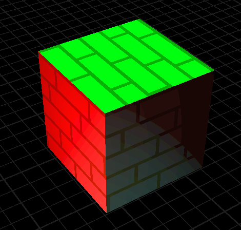
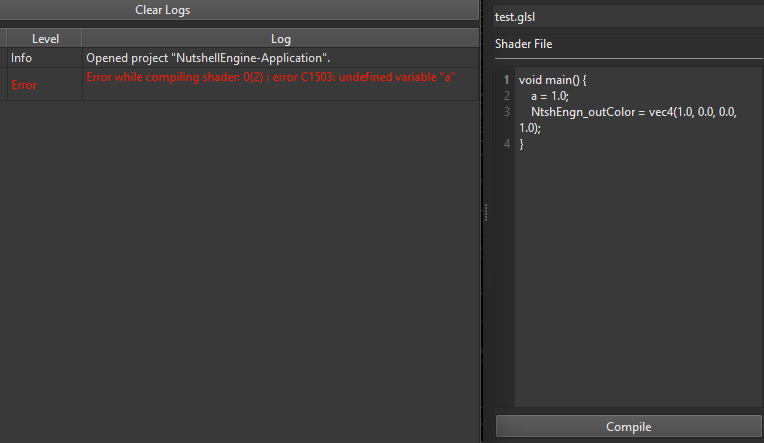
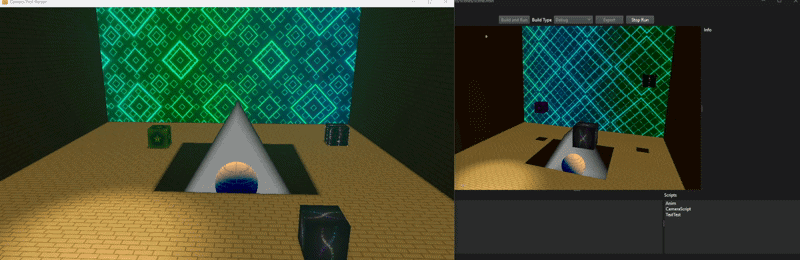
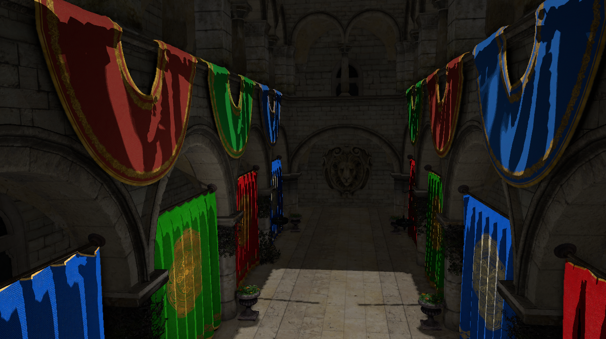
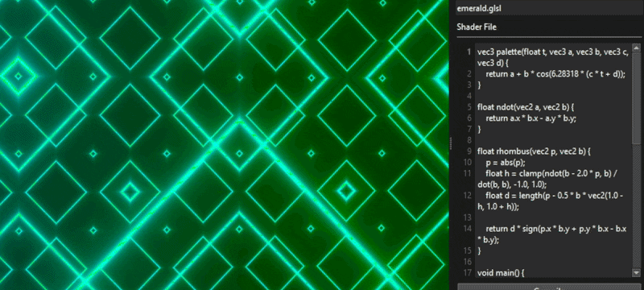
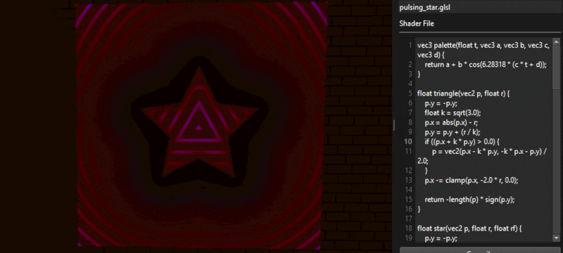
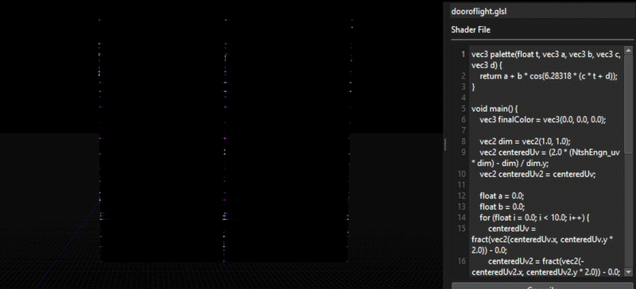
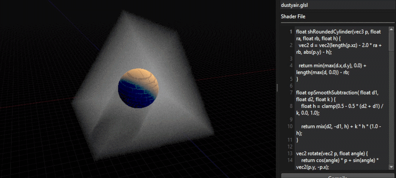

# Custom Fragment Shaders in NutshellEngine
Letting the possibility for users to write their own fragment shaders allows them to **make objects look completely different to how the default renderer you provide to them do**. It's a really important feature that can improve the diversity of graphics styles in your engine without modifying the renderer itself, which would require to know some OpenGL/DirectX/Vulkan/insert the graphics API you are using.

## History
I have been wanting to add custom fragment shaders to NutshellEngine **for quite some time** (2 years actually). I even mention it in [the NutshellEngine's 1st anniversary article](https://www.team-nutshell.dev/nutshellengine/articles/1stanniversary.html), where I considered this feature as a major step to reach the 1.0 state of NutshellEngine.


*The original issue for custom shaders*

This issue took a long time because there were other things to work on first, but also because it's **a really complicated feature to design correctly**.

In the same article, I mention one of the main issue: **which shading language to chose**?

## Chosing a shading language
Chosing a shading language has been the most complicated question for this feature. NutshellEngine is a modular game engine, the renderer is provided through a dynamic library and **no other module**, not even scripts, **knows which graphics API the renderer is using**. What it means is that it can be an OpenGL renderer, a DirectX renderer, a Vulkan renderer, etc., and **only the renderer knows**.

So, here are all the languages I considered for this feature and the positive and negative points about each of them, for my case:

| Language | + | - |
|----------|---|---|
| GLSL | - Easy to learn, probably the most simple shading language in the list,<br>- Supported natively by **OpenGL**,<br>- Can be compiled to SPIR-V for **Vulkan** with *Glslang*,<br>- Can be compiled to SPIR-V with *Glslang* then back to HLSL for **DirectX** with *SPIRV-Cross*. | - Pretty old language that doesn't get many evolution nowadays. |
| HLSL | - More sophisticated than GLSL, more flexible,<br>- Supported natively for **DirectX**, <br>- Can be compiled to SPIR-V for **OpenGL** and **Vulkan** with *dxc*. | - More complex than GLSL. |
| Slang | - Actively being worked on, regularly updated,<br>- Can be compiled to SPIR-V for **Vulkan**.<br>- Can be compiled to HLSL for **DirectX**. | - Currently, compilation to OpenGL GLSL seems to be unsupported,<br>- Pretty big to compile if integrated as a library via source. |
| Custom language | - Can be completely adapted for NutshellEngine's needs. | - Need to work on compilers for all graphics APIs. |

All these options have been considered, but ultimately, **GLSL** has been chosen for its simplicity and how easy the toolset can be added to projects. Slang was close to be the one, but I like to integrate external libraries via sources instead of binaries to be able to modify them easily, and Slang is not the best for this case.

## User-written fragment shaders
Now that the language has been selected, how do we use it exactly?

Writing **complete fragment shaders**, with extensions and layout declarations is **not possible**, as **all these architecture choices are up to the renderer**. Maybe some OpenGL renderer passes all material parameters through **uniforms**, and another Vulkan renderer uses a **bindless descriptor design and indexes textures**, requiring nonuniformEXT(). There are an infinite number of use cases that can't be taken in count by the shader's author, so there must be a generic way to access resources.

I went with a ``#define`` list, which sets a list of inputs and outputs (you can find the ones currently available [in the docs](https://www.team-nutshell.dev/nutshellengine-docs/fragment_shader/index.html)).

Fragment shaders written by users are prefixed with a piece of code that contains the data layout and multiple ``#define``s declaring all the ``NtshEngn_`` "variables" and their equivalent in the renderer.

For example, the editor uses OpenGL, and the prefix is:
```glsl
#version 460

#define NtshEngn_position fragPosition
#define NtshEngn_normal fragTBN[2]
#define NtshEngn_tangent fragTBN[0]
#define NtshEngn_bitangent fragTBN[1]
#define NtshEngn_uv fragUV
#define NtshEngn_tbn fragTBN
#define NtshEngn_diffuseTexture diffuseTextureSampler
#define NtshEngn_normalTexture normalTextureSampler
#define NtshEngn_metalnessTexture metalnessTextureSampler
#define NtshEngn_roughnessTexture roughnessTextureSampler
#define NtshEngn_occlusionTexture occlusionTextureSampler
#define NtshEngn_emissiveTexture emissiveTextureSampler
#define NtshEngn_emissiveFactor emissiveFactor
#define NtshEngn_alphaCutoff alphaCutoff
#define NtshEngn_scaleUV scaleUV
#define NtshEngn_offsetUV offsetUV
#define NtshEngn_useTriplanarMapping useTriplanarMapping
#define NtshEngn_directionalLightCount lights.count.x
#define NtshEngn_directionalLight(i) lights.info[i]
#define NtshEngn_pointLightCount lights.count.y
#define NtshEngn_pointLight(i) lights.info[lights.count.x + i]
#define NtshEngn_spotLightCount lights.count.z
#define NtshEngn_spotLight(i) lights.info[lights.count.x + lights.count.y + i]
#define NtshEngn_ambientLightCount lights.count.w
#define NtshEngn_ambientLight(i) lights.info[lights.count.x + lights.count.y + lights.count.z + i]
#define NtshEngn_time time
#define NtshEngn_cameraPosition cameraPosition
#define NtshEngn_useReversedDepth true
#define NtshEngn_outColor outColor
#define NtshEngn_outDepth gl_FragDepth

in vec3 position;
in vec2 uv;
in mat3 tbn;

struct Light {
	vec3 position;
	vec3 direction;
	vec3 color;
	float intensity;
	vec2 cutoff;
	float distance;
};

struct Shadow {
	mat4 viewProj;
	float splitDepth;
};

in vec3 fragPosition;
in vec2 fragUV;
in mat3 fragTBN;

uniform sampler2D diffuseTextureSampler;

uniform sampler2D normalTextureSampler;

uniform sampler2D metalnessTextureSampler;

uniform sampler2D roughnessTextureSampler;

uniform sampler2D occlusionTextureSampler;

uniform sampler2D emissiveTextureSampler;
uniform float emissiveFactor;

uniform float alphaCutoff;

uniform bool useTriplanarMapping;
uniform vec2 scaleUV;
uniform vec2 offsetUV;

uniform vec3 cameraPosition;
uniform vec3 cameraDirection;
uniform mat4 view;

uniform float time;

uniform sampler2DArray shadowMapSampler;

layout(binding = 0) restrict readonly buffer LightBuffer {
	uvec4 count;
	Light info[];
} lights;

layout(binding = 1) restrict readonly buffer ShadowMapBuffer {
	Shadow info[];
} shadows;

out vec4 outColor;
```

When it's time to compile the user-written fragment shader, the prefix is added to the code written by the user, and is then compiled.

A fragment shader that shades an object with the scene's lights while using the diffuse texture included in the object's material would be written this way:
```glsl
void main() {
	vec4 diffuseColor = texture(NtshEngn_diffuseTexture, NtshEngn_uv);

	vec3 finalColor = vec3(0.0);
	for (int i = 0; i < NtshEngn_directionalLightCount; i++) {
		vec3 l = -NtshEngn_directionalLight(i).direction;
		finalColor += diffuseColor.rgb * NtshEngn_directionalLight(i).color * dot(l, NtshEngn_normal);
	}

	for (int i = 0; i < NtshEngn_pointLightCount; i++) {
		vec3 l = normalize(NtshEngn_pointLight(i).position - NtshEngn_position);
		float distance = length(NtshEngn_pointLight(i).position - NtshEngn_position);
		if (distance > NtshEngn_pointLight(i).distance) {
			continue;
		}

		float attenuation = 1.0 / (distance * distance);
		vec3 radiance = (NtshEngn_pointLight(i).color * NtshEngn_pointLight(i).intensity) * attenuation;

		finalColor += diffuseColor.rgb * radiance * dot(l, NtshEngn_normal);
	}

	for (int i = 0; i < NtshEngn_spotLightCount; i++) {
		vec3 l = normalize(NtshEngn_spotLight(i).position - NtshEngn_position);
		float distance = length(NtshEngn_spotLight(i).position - NtshEngn_position);
		if (distance > NtshEngn_spotLight(i).distance) {
			continue;
		}

		float theta = dot(l, -NtshEngn_spotLight(i).direction);
		float epsilon = cos(NtshEngn_spotLight(i).cutoff.y) - cos(NtshEngn_spotLight(i).cutoff.x);
		float intensity = clamp((theta - cos(NtshEngn_spotLight(i).cutoff.x)) / epsilon, 0.0, 1.0);
		intensity = 1.0 - intensity;

		finalColor += diffuseColor.rgb * NtshEngn_spotLight(i).color * intensity;
	}
    NtshEngn_outColor = vec4(finalColor, diffuseColor.a);
}
```

And give this result:



*A cube shaded with the fragment shader above, the scene contains a green directional light, a red point light and a blue spot light*

## Integration in renderers
The custom fragment shader system has been integrated within 3 renderers currently:
- The [editor](https://github.com/Team-Nutshell/NutshellEngine-Editor)'s renderer, in OpenGL, uses forward rendering,
- [vulkan-renderer](https://github.com/Team-Nutshell/NutshellEngine-GraphicsModule/tree/module/vulkan-renderer), which is a "simple" Vulkan renderer used to test new features, which uses forward rendering and has no post-processing,
- [sirius](https://github.com/Team-Nutshell/NutshellEngine-GraphicsModule/tree/module/sirius), NutshellEngine's main runtime renderer, used in games. Uses deferred rendering and have some post-process passes.

For the two renderers with forward rendering, the process was pretty easy, as you only need to **take the default fragment shader, extract the layout, write the ``#define``s and you got the prefix**. The objects using custom fragment shaders can be rendered after the objects using the default shader to limit state switching.

For Sirius, the process was more complex. A deferred renderer means that a G-Buffer is made before calculating the lighting in a compositing pass. This compositing pass uses a fullscreen triangle and is generic for all objects. There are multiple ways to integrate custom fragment shaders into this renderer:
- Get all fragment shaders in the assets and create a ubershader for the compositing pass, each index has an ID for the part of the shader it would be using (example: 0 would be the default shading, 1 would be custom shader A, 2 would be custom shader B, etc.).
- Do a forward pass after compositing, while keeping the depth buffer filled during the G-Buffer pass.

For the moment, I decided to do a forward pass after compositing. As the G-Buffer was also used for SSAO, I also modified the SSAO to reconstruct the position and normal from the depth buffer instead of using the G-Buffer's position and normal images, as the objects with custom fragment shaders were not included in them.

Sirius also has a GPU frustum culling pass, which outputs draw indirect commands in buffers for each camera (so the scene camera and the cameras used for shadowmapping) in a single dispatch. **Draw indirect is incompatible with graphics pipelines switching**, so I tweaked the frustum culling compute shader to add a way to let pass or fail specific objects, and I always fail the frustum culling pass for objects with custom fragment shaders if the camera is a scene camera (so they are still included for shadowmapping), and perform a **CPU frustum culling** during the forward pass.

## Tooling
The editor has some tooling for this feature. A widget allows to **write fragment shaders in a small code editor** for quick edits (writing them in an external code editor is always possible) and a button to compile them, which writes **warnings and errors to the log widget**. As there is a prefix, the log is parsed to extract the line number and subtract it by around the size of the prefix to make the error line number appear correctly for the user.



*Left: Log widget showing an error, Right: Code editor*

## Why not custom vertex shaders
I only implemented custom fragment shaders at the moment, as **custom vertex shaders have other architecture issues**.

First, **it doesn't work well with frustum culling**. For frustum culling, you expect the vertex shader to position each vertex in the world according to the object's model matrix so its world-space bounding volume is predictable. With custom vertex shaders, they can be placed anywhere in the world, and **predicting the bounding volume after arbitrary vertex shaders is an issue** (animation has this kind of issues too but you can calculate the animations' global bounding volume and work with that).

You also have to take **shadowmapping** in count, and create pipelines for shadowmapping for each custom vertex shader, while avoiding including pieces of code that would slow down the shader and produce data that would be unused by the fragment shader (for example, you may not need the normal, tangent, bitangent, and other data for shadowmapping).

## Results


*Left: Runtime with Sirius, Right: Editor, 5 cubes have a custom fragment shader*


*Sponza but the banners and curtains have a custom cell-shading fragment shader*

The ``NtshEngn_time`` gives the time since the application launched in seconds and allows to do some animation in shaders.






## Future improvements
This system still has room for improvements:
- **Adding more ``NtshEngn_`` variables**, notably, a way to access shadow maps (maybe an entire function to sample shadow maps correctly),
- **Adding the possibility to pass data from scripts**, the custom fragment shaders could have a way to declare custom inputs with identifiers to edit the value through gameplay scripts,
- **Adding a way to extend the default fragment shader instead of writing a new one entirely**, it would allow to apply changes while staying close to the default shading,
- **Extend the system for post-process passes**,
- **Make it compatible with GPU frustum culling**.

And also, **adding custom vertex shader**.