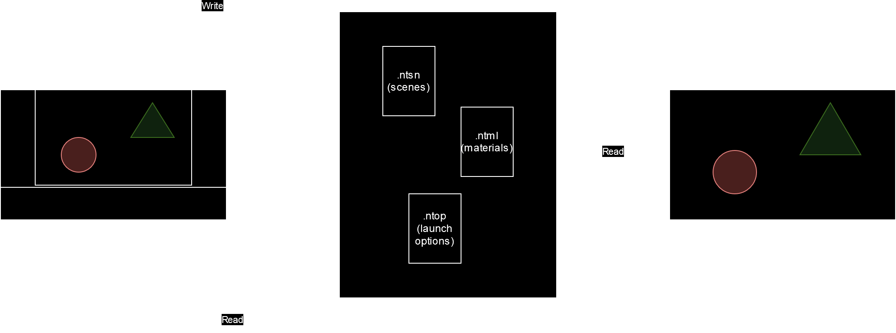
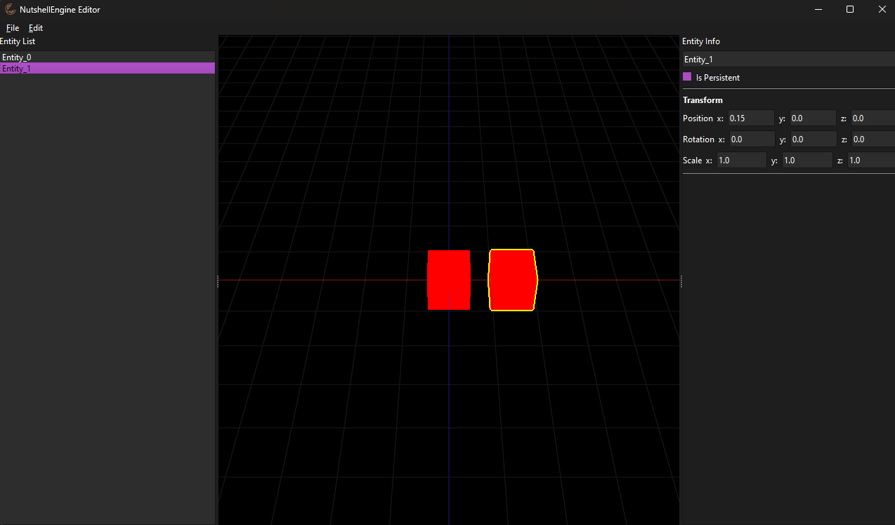
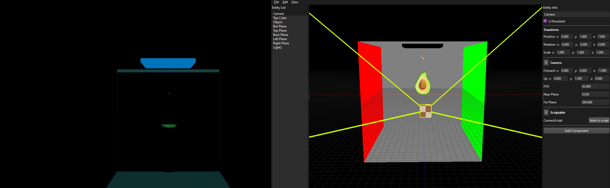
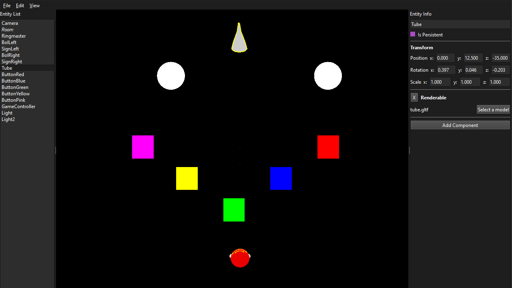
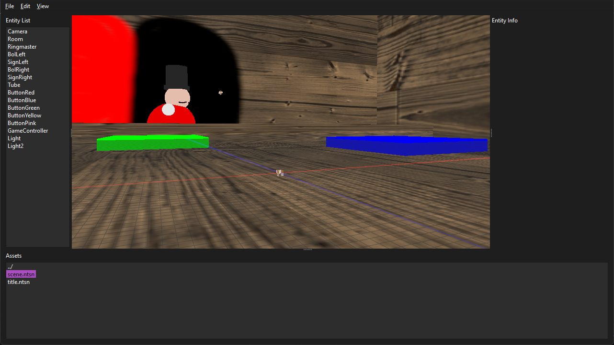
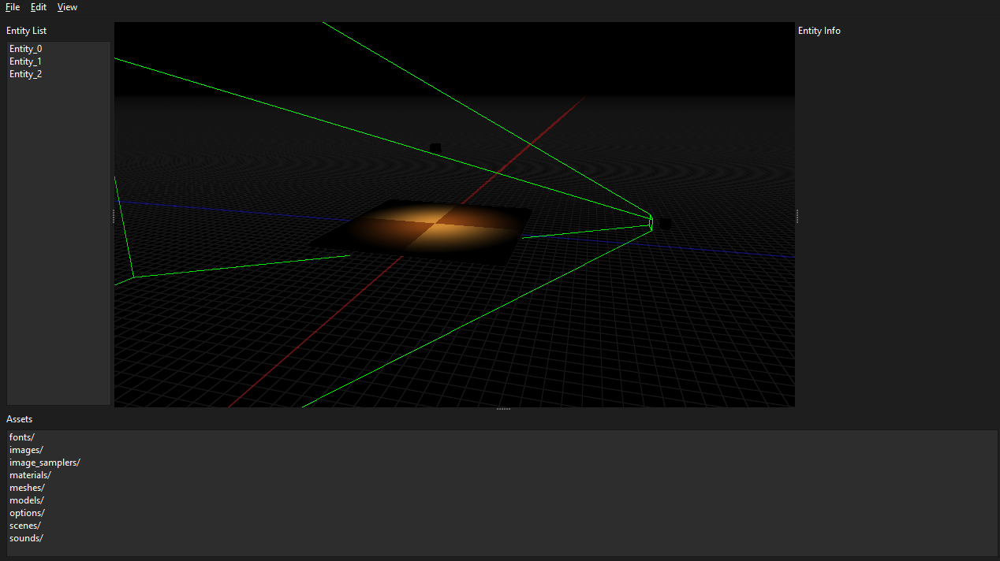

# Developing NutshellEngine's first editor

NutshellEngine has been in development for around one and a half year, and while I have mostly focused on the engine's "runtime", the actual software, **having an editor has always been a distant goal**, something I would do in a few years, once I have nothing else to do (which obviously never happens with a game engine...). My reasoning was simple: I was probably going to be the only one using this game engine, so why would I bother? I can *perfectly* work without one.

But now that I have a primitive editor for my game engine, I can say it: this reasoning was terrible.

Making an editor for a game engine won't only allow you to actually make games way faster than before, it will also **allow you to experiment on your game engine's features faster too**. You want to check some specific lighting or physics? No need to try to find the right coordinates for your objects anymore, you can just *place* them. **It has really been a game changer**.

I've been undecided on how to make an editor for NutshellEngine for many months, because I wanted it to be perfect from the start. The original goal was to **make the editor with the game engine**, as NutshellEngine is a modular game engine, I could just use the modules directly in the editor if it is made with the engine itself. And **I think it really is the best option**. *But*, NutshellEngine is still young, and is **still lacking some features to make a good editor**, like a proper UI library to create widgets, or a way to use custom shaders with the Renderable Component of the entities (coming soon).

So I decided to actually **make the editor completely separate from the engine**, and it is fine, the only elements in games that are tied to the engine's core are the scripts, the rest (assets like images, sounds, models, scene files, materials, ...) is just read at runtime, so the editor could just work on these, and launching the game executable would read these files, written by the editor.

*Relation between the editor, the assets and the engine's core*

## Choices of technology
So, what to use to make this first editor? I needed something that would allow me to:
- **Add widgets**, a lot of types of widgets, to edit strings, numbers, pick a color or a file, a checkbox, etc.,
- **Render**, I need to be able to see what my scenes look like,
- **Load assets files** like models, depending on the language, it could be an issue,
- **Read and write files**.

As it is my first editor, I had no real plan on what I would do so I decided **to use some simple things to quickly prototype**, modify and delete. My choices were **Python** as the language, with **Qt** (*PyQt*) for the windowing and widgets and **OpenGL** (*PyOpenGL*) for the rendering.

I would say **they were pretty good choices** as I've been able to have something going on within only a few days.

*Editor in Python at the start*

It's really simple but the basics are here:
- The list of entities on the left, I can create new ones and destroy them,
- The renderer at the center, it did not do much but had an infinite grid on the XZ plane, simple cubes for the entities and basic WASD camera controls,
- The list of components for the current entity on the right, with just the Transform component to start.

It could also do something nice: **Undo/Redo**. Qt helps a lot with it, using [QUndoStack](https://doc.qt.io/qt-6/qundostack.html), but **if you don't implement it from the very beginning, adding it later is going to be a nightmare**.

The next step would be to add more components, loading assets, and reading and writing scene files.

*Left: NutshellEngine, Right: the editor*

Many things were added, like:
- **More components**, especially the **Renderable** one,
- **Load some types of assets files**, like *GLTF* and NutshellEngine's own formats,
- **Read and write scenes**,
- **Move, rotate and scale objects** directly on the renderer,
- Switch between **perspective and orthographic projections**, with different point of views for the orthographic projection.

The orthographic projection is especially important as it is **way easier to align and rotate the objects with an orthographic projection** than with a perspective projection.

*It can also help you see that what you thought aligned was actually terribly not...*

After two weeks, the editor was in pretty good shape, but had a *little* issue... **it was terribly slow**. For example, loading the scene from [the game we made during Global Game Jam 2024](https://ntsh-oni.itch.io/make-me-laugh-clown-shop-ggj24) took 3.3 seconds. There are some little GLTF models to load, but it shouldn't be that slow.

I am not blaming Python for this, even if the language isn't known for its speed, but **I probably lack experience on making fast Python code**. I investigated the issue, tried many solutions but it was still too slow for me, so I took a decision: **rewriting the editor in C++**.

## Rewriting the editor for speed
Rewriting the editor in C++ was straightforward, as I still used **Qt** and **OpenGL**. It was pretty long, as there were 4000 lines of Python to "convert", but after a few days, I was done with the basic rewriting.

*Editor in C++, after the rewrite*

It looks the same, minus some differences that I can't really explain as PyQt and Qt on C++ should give the same result, but now, it is **much faster**, the scene that loaded in 3.3 seconds now loads **instantly** in C++.

Seeing how close the Python and C++ versions are, **I am convinced that I shouldn't have done a Python version first, and go straight with C++**. The Python version isn't simpler than the C++ one, as the majority of the code is just Qt and OpenGL, which are basically the same for both languages.

After that, I improved it some more, adding basic lighting to the renderer and greatly improving usability with better keybindings, copy and paste, a look into the assets directory at the bottom, to quickly open scenes, images or options files.

*Editor in C++, now with lighting*

## Conclusion
Even if it's far from perfect, I am really happy with how this first editor turned out, and **I think that the C++/Qt/OpenGL combo is a really efficient one to make an editor quickly**. I use it everytime I want to do something with my engine, which is a good sign. I will continue to work on it and improve it, until NutshellEngine is ready to have its editor made with it.