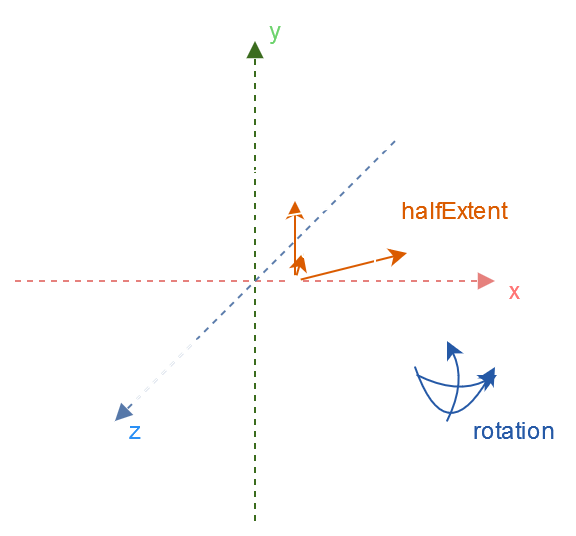
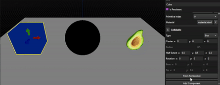
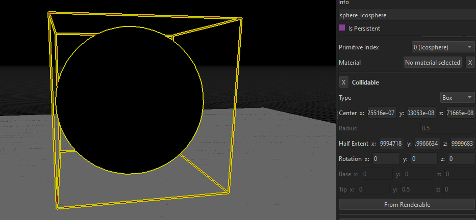
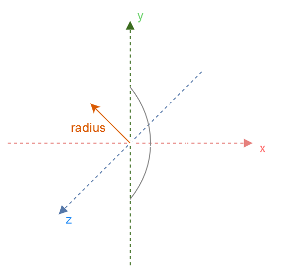
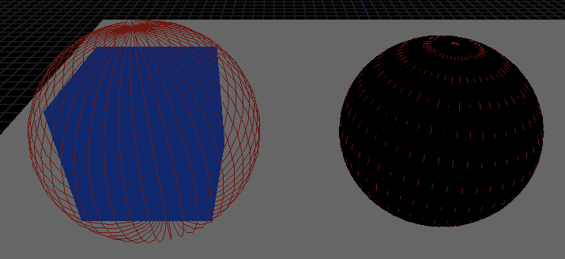
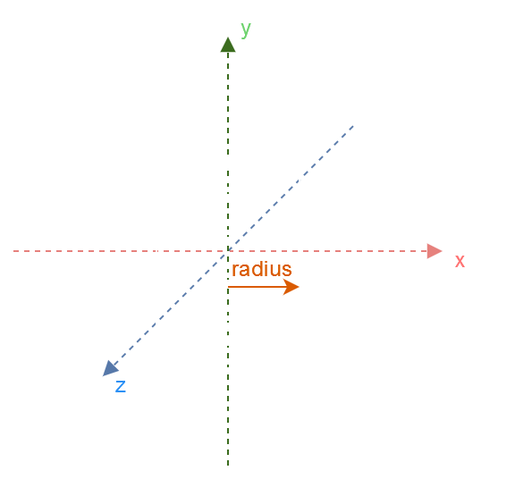
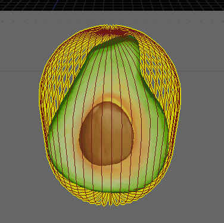

# Calculating an OBB from a Mesh

While working on a game using NutshellEngine, I realized that **creating a correctly fitting bounding box around a mesh by hand** was a really time consuming issue, especially when a scene can contain hundreds of entities. I then decided to look into methods to fit an OBB from a mesh.

## Oriented Bounding Box
This is the OBB structure I will use in this article:

```cpp
struct OBB {
    Math::vec3 center; // Center of the OBB
    Math::vec3 halfExtent; // Half of the size for each axis
    Math::vec3 rotation; // Rotation in Euler angles for each axis
};
```



## Principal Component Analysis
The method described in this article uses [Principal Component Analysis](https://en.wikipedia.org/wiki/Principal_component_analysis), or PCA.

This method takes a **list of points** and returns **direction vectors**, orthogonals to each other, that fit the data. These vectors can be used as an **orthonormal base** that will be used **to find the half extend and rotation of our OBB**.

### The issue
This method would be absolutely perfect to fit an OBB from a Mesh but **PCA has a limit**, it assumes the data is [**distributed according to a Gaussian distribution**](https://www.cs.princeton.edu/picasso/mats/PCA-Tutorial-Intuition_jp.pdf) (*page 7*), which is definitely not the case for a mesh.

While this method is going to have good results on some meshes, it can completely fail on others, but the result can be used as a starting point to quickly fit the OBB by hand.

## The method
### Data treatment
The first step consists of treating the data, this data being **our mesh's vertices**. We are going to make a list of all the mesh's vertices, **excluding the duplicates**.

```cpp
auto uniquePositionsCmp = [](const vec3& a, const vec3& b) {
	return to_string(a) < to_string(b);
	};

std::set<vec3, decltype(uniquePositionsCmp)> uniquePositions(uniquePositionsCmp);

for (size_t j = 0; j < mesh.vertices.size(); j++) {
	uniquePositions.insert(mesh.vertices[j].position);
}
```

I use a lexicographical comparison on the string representation of the position of the vertices to insert them into a set, but you can use whatever method you want, as long as you don't have duplicate positions into the set.

### Finding the center
The center of our ABB is the mean of the position on each axis.

```cpp
float size = static_cast<float>(uniquePositions.size());

const vec3 means = std::reduce(uniquePositions.begin(), uniquePositions.end(), vec3(0.0f, 0.0f, 0.0f), [](vec3 acc, const vec3& val) { return acc + val; }) / size;

obb.center = means; // OBB center is the mean of the mesh's vertices positions
```

### Constructing the covariance matrix
We can now construct the [**covariance matrix**](https://en.wikipedia.org/wiki/Covariance_matrix) needed for Principal Component Analysis.

The covariance matrix is a square matrix that represents the multi-dimensional covariance of a set. One of the interesting properties we are going to use is that **covariance matrices are symmetric** (because Cov(x, y) == Cov(y, x)), so only half of the matrix (+ the diagonal) are interesting for us.

```cpp
mat3 covarianceMatrix; // Using a full mat3 is not actually needed as the covariance matrix is symmetric
for (const vec3& position : uniquePositions) {
	covarianceMatrix.x.x += (position.x - means.x) * (position.x - means.x); // Variance of x
	covarianceMatrix.y.y += (position.y - means.y) * (position.y - means.y); // Variance of y
	covarianceMatrix.z.z += (position.z - means.z) * (position.z - means.z); // Variance of z
	covarianceMatrix.x.y += (position.x - means.x) * (position.y - means.y); // Covariance of x and y
	covarianceMatrix.x.z += (position.x - means.x) * (position.z - means.z); // Covariance of x and z
	covarianceMatrix.y.z += (position.y - means.y) * (position.z - means.z); // Covariance of y and z
}
covarianceMatrix.x.x /= size;
covarianceMatrix.y.y /= size;
covarianceMatrix.z.z /= size;
covarianceMatrix.x.y /= size;
covarianceMatrix.x.z /= size;
covarianceMatrix.y.z /= size;
```

### Calculating the Eigenvectors and Eigenvalues
We now need to **calculate the eigenvectors and eigenvalues** of our covariance matrix. **These eigenvectors are the orthonormal base** while their corresponding eigenvalues indicate how important each eigenvector is.

To calculate them, either you already use **a mathematics library able to do it** (example: [Eigen](https://eigen.tuxfamily.org/index.php?title=Main_Page)) or **you can implement one of the many closed-form available in scientific papers**.

For my implementation, I used [**Siddique, Abu Bakar, and Tariq A. Khraishi. "Eigenvalues and Eigenvectors for 3x3 Symmetric Matrices: An Analytical Approach." Journal of Advances in Mathematics and Computer Science 35.7 (2020): 106-118.**](https://www.researchgate.net/publication/344819102_Eigenvalues_and_Eigenvectors_for_33_Symmetric_Matrices_An_Analytical_Approach), as **our covariance matrix is a 3x3 symmetric matrix**.

You can see the implementation of this paper in [nml's ``mat3`` class](https://github.com/Team-Nutshell/nml/blob/main/src/mat3.cpp) (under the function name ``eigen()``). Due to floating point precision, you can play with the ``epsilon`` value to greatly change the results.

The eigenvectors must be **normalized**.

### Calculating the half-extent and rotation
Now that we have our eigenvectors and eigenvalues, we can finish calculating our OBB.

We start by sorting our eigenvectors according to their corresponding eigenvalues, as a greater eigenvalue indicate a more important eigenvector.

```cpp
std::array<std::pair<float, vec3>, 3> eigen = covarianceMatrix.eigen();
std::sort(eigen.begin(), eigen.end(), [](const std::pair<float, vec3>& a, const std::pair<float, vec3>& b) {
	return a.first > b.first;
	});
```

We can then **project each vertex along each eigenvector** to find the furthest point, giving use the half-extent for each axis.

```cpp
for (const vec3& position : uniquePositions) {
	const vec3 positionMinusCenter = position - means;

	const float extentX = std::abs(dot(eigen[0].second, positionMinusCenter));
	if (extentX > obb.halfExtent.x) {
		obb.halfExtent.x = extentX;
	}

	const float extentY = std::abs(dot(eigen[1].second, positionMinusCenter));
	if (extentY > obb.halfExtent.y) {
		obb.halfExtent.y = extentY;
	}

	const float extentZ = std::abs(dot(eigen[2].second, positionMinusCenter));
	if (extentZ > obb.halfExtent.z) {
		obb.halfExtent.z = extentZ;
	}
}
```

And finally use our orthonormal base made with our eigenvectors as a rotation matrix to find the OBB's rotation.

```cpp
mat4 rotationMatrix = mat4(vec4(eigen[0].second, 0.0f), vec4(eigen[1].second, 0.0f), vec4(eigen[2].second, 0.0f), vec4(0.0f, 0.0f, 0.0f, 1.0f));

// Rotation matrix to euler angles, not needed if you don't represent your OBB rotation as euler angles
obb.rotation.y = std::asin(std::clamp(rotationMatrix.z.x, -1.0f, 1.0f));
if (std::abs(rotationMatrix.z.x) < (1.0f - std::numeric_limits<float>::epsilon())) {
    obb.rotation.x = std::atan2(-rotationMatrix.z.y, rotationMatrix.z.z);
    obb.rotation.z = std::atan2(-rotationMatrix.y.x, rotationMatrix.x.x);
}
else {
    obb.rotation.x = std::atan2(rotationMatrix.y.z, rotationMatrix.y.y);
    obb.rotation.z = 0.0f;
}
```

## Results


As you can see, the results are far from perfect as this method really depends on the mesh, its number of vertices and how they are distributed, but allow to tweak the resulting OBB from a solid base.



Here, the OBB created from a sphere mesh (icosphere) has been corrected by simply putting all the rotation angles to 0.

## Bonus: Sphere and Capsule
Spheres and capsules are two widely used types of colliders, and they can be calculated from a mesh too.

### Sphere from a Mesh
```cpp
struct Sphere {
    Math::vec3 center; // Center of the sphere
    float radius; // Radius of the sphere
};
```



The center of the sphere can be calculated using the mean of the positions, same as the OBB.

The radius of the sphere can be calculated by taking the distance to the furthest point from the sphere's center:

```cpp
for (const vec3& position : uniquePositions) {
	const vec3 positionMinusCenter = position - means;

	const float positionMinusCenterSquaredLength = dot(positionMinusCenter, positionMinusCenter);
	if (positionMinusCenterSquaredLength > sphere.radius) {
		sphere.radius = positionMinusCenterSquaredLength;
	}
}

sphere.radius = std::sqrt(sphere.radius);
```

For speed purposes, only the squared radius is stored and compared, the actual radius is calculated at the end with a square root.



*Spheres from a cube and a sphere mesh (icosphere), no manual correction*

### Capsule from a Mesh
```cpp
struct Capsule {
    Math::vec3 base; // Base of the capsule
    Math::vec3 tip; // Tip of the capsule
    float radius; // Radius of the capsule
};
```



Capsules use the same method as the OBB, with Principal Component Analysis.

After calculating the eigenvectors and eigenvalues, and sorting them, the eigenvector with the biggest eigenvalue is the axis where the base and tip will be, while the eigenvector with the second biggest eigenvalue will be used to calculate the capsule's radius.

```cpp
float segmentLengthMax = 0.0f;
for (const vec3& position : uniquePositions) {
	const vec3 positionMinusCenter = position - means;

	// Calculate the length of the base-tip segment
	const float segmentLength = std::abs(dot(eigen[0].second, positionMinusCenter));
	if (segmentLength > segmentLengthMax) {
		segmentLengthMax = segmentLength;
	}

	// Calculate the radius
	const float radius = std::abs(dot(eigen[1].second, positionMinusCenter));
	if (radius > capsule.radius) {
		capsule.radius = radius;
	}
}

capsule.base = means - (eigen[0].second * (segmentLengthMax - capsule.radius));
capsule.tip = means + (eigen[0].second * (segmentLengthMax - capsule.radius));
```



*Capsule from an [avocado mesh](https://github.com/KhronosGroup/glTF-Sample-Models/tree/main/2.0/Avocado/), no manual correction*

## Full implementation
The full implementation can be found on the [NutshellEngine-Editor's repository](https://github.com/Team-Nutshell/NutshellEngine-Editor/blob/main/src/renderer/renderer_resource_manager.cpp), where all 3 types are calculated at the same time in the ``loadMeshColliders`` function.