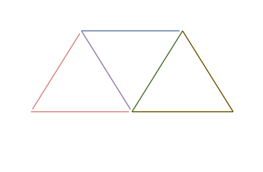

# GPU-driven Particle Rendering - Part 2

In the [first part](particle-rendering.md), we were able to render a lot of colored particles with points primitives. At the end of this article, I explained that to add textures, we would need to use two triangles to make a quad instead of points, and this is what we are doing in this second part.

## The method
Our goal here is to **take a single point and make a quad composed of two triangles around it**.


Even if our points look like quad, they are **pretty limited compared to a real quad made of two triangles**, as they can't be rotated nor textured.

The first objective is then to take our list of points we finished with in the last article and render quads.

### Point to Quad
In the end of the first article, I talked about **either using a compute shader or a geometry shader** but **we are going to do something completely different**. A compute shader would require a few more buffers to store the triangles and geometry shaders are less and less supported so this solution would not be possible on all devices.

So what is the trick then? User *sfaer* on the Vulkan Discord pointed me a pretty nice solution using **Instancing**.

What if, instead of rendering *nbParticles* vertices, we **draw 4 vertices**, *nbParticles* **times**? We would then only need to position our 4 vertices in the vertex shader, while also giving them texture coordinates and we're done!

To perform this, we need to change some things from the first part:

We used to only write on the first 4 bytes of the *draw indirect buffer*, where ``vertexCount`` is located in the [``VkDrawIndirectCommand``](https://registry.khronos.org/vulkan/specs/latest/man/html/VkDrawIndirectCommand.html) structure, here, ``vertexCount`` **will always be 4**, and we are going to **write on the next 4 bytes** containing ``instanceCount``, which will be the number of active particles.

### Particle structure
This is the updated particle structure in C++:
```cpp
struct Particle {
	vec3 position = { 0.0f, 0.0f, 0.0f };
	float size = 0.0f;
	vec4 color = { 0.0f, 0.0f, 0.0f, 0.0f };
	vec3 direction = { 0.0f, 0.0f, 0.0f };
	float speed = 0.0f;
	float duration = 0.0f;
	float rotation = 0.0f; // New attribute
	uint32_t textureIndex = 0; // New attribute
	float padding = 0.0f;
};
```

We added two new attributes, ``rotation`` and ``textureIndex``.

``rotation`` is the rotation of the particle around its "z"-axis.


``textureIndex`` is the **index of a texture inside a descriptor**, as I use a bindless design in my Vulkan renderer.

While we added two attributes of 4 bytes each, **the size of the structure didn't actually grow**, as we had 12 bytes of padding for alignement before, we just have 4 now.

### Compute shader
This is the updated compute shader:
```glsl
#version 460

layout(local_size_x = 64) in;

struct Particle {
	vec3 position;
	float size;
	vec4 color;
	vec3 direction;
	float speed;
	float duration;
	float rotation; // New attribute
	uint textureIndex; // New attribute
};

layout(set = 0, binding = 0) restrict readonly buffer InParticles {
	Particle particles[];
} inParticles;

layout(set = 0, binding = 1) restrict writeonly buffer OutParticles {
	Particle particles[];
} outParticles;

layout(set = 0, binding = 2) buffer OutDrawIndirect {
	uint vertexCount; // This attribute stays for alignment reasons but we are not writing on it
	uint instanceCount; // The instance count will be written on
} outDrawIndirect;

layout(push_constant) uniform DeltaTime {
	float deltaTime;
} dT;

void main() {
	uint index = gl_GlobalInvocationID.x;

	Particle inParticle = inParticles.particles[index];

	float newDuration = inParticle.duration - dT.deltaTime;
	if (newDuration >= 0.0) {
		uint particleIndex = atomicAdd(outDrawIndirect.instanceCount, 1); // We are incrementing instanceCount instead of vertexCount

		outParticles.particles[particleIndex].position = inParticle.position + (inParticle.direction * inParticle.speed * dT.deltaTime);
		outParticles.particles[particleIndex].size = inParticle.size;
		outParticles.particles[particleIndex].color = inParticle.color;
		outParticles.particles[particleIndex].direction = inParticle.direction;
		outParticles.particles[particleIndex].speed = inParticle.speed;
		outParticles.particles[particleIndex].duration = newDuration;
		outParticles.particles[particleIndex].rotation = inParticle.rotation; // Copy new attribute
		outParticles.particles[particleIndex].textureIndex = inParticle.textureIndex; // Copy new attribute
	}
}
```

Not a lot changed, we just added ``instanceCount`` in the ``OutDrawIndirect`` structure and are incrementing ``instanceCount`` instead of ``vertexCount``. We also copied the two new ``rotation`` and ``textureIndex`` attributes.

The buffers were we stored our particles were used as **vertex buffer**, but it won't be the case anymore here, at least not the traditional way. We are going to use **Programmable Vertex Pulling**, which is a fancy term to just say that we are going to read the vertex attributes from a storage buffer instead of a vertex buffer.

### Graphics pipeline
The graphics pipeline only change (excepted its shaders) is **the topology used to render our particles**, it used to be Points, it is now **Triangle Strips**.

Triangle Strips are a topology type where, for each vertex, a triangle is created with the 2 next vertices. To keep the winding order consistent through the entire mesh, **the order of the vertices is inverted after each triangle**.



Also, it wasn't useful before as points don't have any winding order, but our **triangles' front faces are counter-clockwise**.

### Vertex shader
The vertex shader is where the point to quad operation happens:
```glsl
#version 460

const vec2 localOffset[4] = vec2[](
	vec2(-0.5, -0.5),
	vec2(0.5, -0.5),
	vec2(-0.5, 0.5),
	vec2(0.5, 0.5)
);

const vec2 localUv[4] = vec2[](
	vec2(0.0, 1.0),
	vec2(1.0, 1.0),
	vec2(0.0, 0.0),
	vec2(1.0, 0.0)
);

struct Particle {
	vec3 position;
	float size;
	vec4 color;
	vec3 direction;
	float speed;
	float duration;
	float rotation;
	uint textureIndex;
};

layout(set = 0, binding = 0) uniform Camera {
	mat4 view;
	mat4 projection;
} camera;

layout(set = 0, binding = 1) restrict readonly buffer Particles {
	Particle particles[];
} particles;

layout(location = 0) out vec4 outColor;
layout(location = 1) out vec2 outUv;
layout(location = 2) flat out uint outTextureIndex;

void main() {
	Particle particle = particles.particles[gl_InstanceIndex];

	outColor = particle.color;
	outUv = localUv[gl_VertexIndex];
	outTextureIndex = particle.textureIndex;

	float cosTheta = cos(particle.rotation);
	float sinTheta = sin(particle.rotation);

	mat2 rotationMatrix = mat2(cosTheta, -sinTheta, sinTheta, cosTheta);
	
	vec2 localPosition = rotationMatrix * (localOffset[gl_VertexIndex] * particle.size);
	vec3 cameraRight = vec3(camera.view[0].x, camera.view[1].x, camera.view[2].x);
	vec3 cameraUp = vec3(camera.view[0].y, camera.view[1].y, camera.view[2].y);

	vec3 worldPosition = particle.position + ((cameraRight * localPosition.x) + (cameraUp * localPosition.y));
	
	gl_Position = camera.projection * camera.view * vec4(worldPosition, 1.0);
}
```

It is now more complicated that in the first part so here is a part-by-part explanation:
```glsl
const vec2 localOffset[4] = vec2[](
	vec2(-0.5, -0.5),
	vec2(0.5, -0.5),
	vec2(-0.5, 0.5),
	vec2(0.5, 0.5)
);

const vec2 localUv[4] = vec2[](
	vec2(0.0, 1.0),
	vec2(1.0, 1.0),
	vec2(0.0, 0.0),
	vec2(1.0, 0.0)
);
```

We are **hard-coding two arrays**.

``localOffset`` is the **offset of our for 4 vertices' positions, relative to (0, 0)** (hence the word ``local``), we are going to get the position of each vertex from this array. It corresponds to **a unit quad** (a quad where each edge has a length of 1).

``localUv`` is the texture coordinate for each vertex.

```glsl
layout(location = 0) out vec4 outColor;
layout(location = 1) out vec2 outUv;
layout(location = 2) flat out uint outTextureIndex;
```

We are now also sending the texture coordinates and the texture index to the fragment shader. The ``flat`` qualifier is used as we want **no interpolation for our texture index** (it is mandatory for integer types).

```glsl
Particle particle = particles.particles[gl_InstanceIndex];
```

**The attributes of the particles are not passed through vertex attributes anymore but via a storage buffer**. The **current instance is the current particle** we are working on, so to get the attributes of the right particle, we use ``gl_InstanceIndex``.

```glsl
outColor = particle.color;
outUv = localUv[gl_VertexIndex];
outTextureIndex = particle.textureIndex;
```

We pass some information to the fragment shader. **We get the texture coordinates** from the ``localUv`` array hard-coded above. This array is indexed with ``gl_VertexIndex`` which can only be 0, 1, 2 or 3, as we draw 4 vertices for each instance.

```glsl
float cosTheta = cos(particle.rotation);
float sinTheta = sin(particle.rotation);

mat2 rotationMatrix = mat2(cosTheta, -sinTheta, sinTheta, cosTheta);
```

We want to rotate our quad according to the rotation attribute (which is **in radians**) so we make **a rotation matrix**. This rotation matrix rotates **clockwise**.

```glsl
vec2 localPosition = rotationMatrix * (localOffset[gl_VertexIndex] * particle.size);
```

We take the **local offset of the current vertex** from the ``localOffset`` array. We then multiply this position by the size of the particle to **give our particle the right size**. And we finally multiply with the rotation matrix to rotate our vertex.

*Note*: We used to set the size of the particle using ``gl_PointSize``. As we don't use points primitives anymore, we cannot do this. Also, ``gl_PointSize`` is a size in **pixels** in **screen-space**. Here, our size is in **world-space**, so our particle will be bigger when we get closer and smaller when we get further.

```glsl
vec3 cameraRight = vec3(camera.view[0].x, camera.view[1].x, camera.view[2].x);
vec3 cameraUp = vec3(camera.view[0].y, camera.view[1].y, camera.view[2].y);
```

Generally, particles are **billboards**, which means that **they always face the camera**. By using the camera's view matrix, we can transform the vertices so that they always face the camera.

```glsl
vec3 worldPosition = particle.position + ((cameraRight * localPosition.x) + (cameraUp * localPosition.y));
```

The final world position of our vertex. We apply the camera's right and up vectors so that it always faces the camera, and **add the actual position of our particle to place it into the world**. ``particle.position`` is the center of our particle.

### Fragment shader
We now have to sample the texture to color our particle:
```glsl
#version 460
#extension GL_EXT_nonuniform_qualifier : enable

layout(set = 0, binding = 2) uniform sampler2D particleTextures[];

layout(location = 0) in vec4 color;
layout(location = 1) in vec2 uv;
layout(location = 2) flat in uint textureIndex;

layout(location = 0) out vec4 outColor;

void main() {
	outColor = texture(particleTextures[nonuniformEXT(textureIndex)], uv) * color;
}
```

And the explanation:

```glsl
#extension GL_EXT_nonuniform_qualifier : enable
```

As the textures are in an array, we need an extension to **tell each thread in a workgroup to sample the texture using their own index**, or else, a thread will tell all the others in the workgroup which index to use.

```glsl
layout(set = 0, binding = 2) uniform sampler2D particleTextures[];
```

All the textures used for particles are in a single array.

```glsl
layout(location = 0) in vec4 color;
layout(location = 1) in vec2 uv;
layout(location = 2) flat in uint textureIndex;
```

The attributes that were written in the vertex shader. Note that we also need to specify ``flat`` for integer types here too.

```glsl
outColor = texture(particleTextures[nonuniformEXT(textureIndex)], uv) * color;
```

We sample the right texture, using the ``nonuniformEXT`` qualifier around the index, using the texture coordinates passed from the vertex shader, and we multiply it with the particle's colors.

The multiplication with the particle's colors is not mandatory, but it **allows you to use level of gray textures and color them using this color attribute**.

## Results


On this frame, we have **98918 particles**, with a texture.

The **compute shader takes 0.05ms** and the **draw takes 0.06ms** on an NVIDIA RTX 4070 GPU.

The texture used is a simple 32x32 texture:

