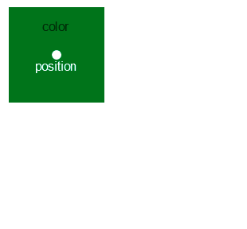
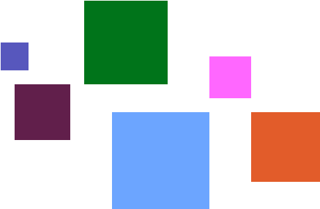
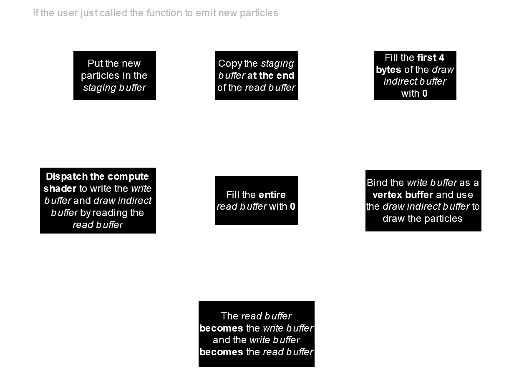
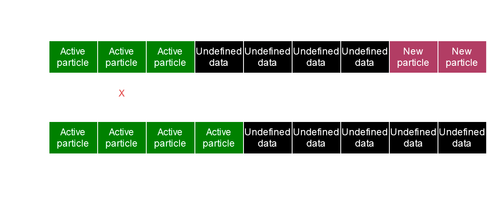
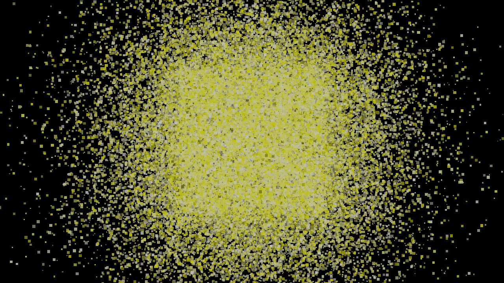

# GPU-driven Particle Rendering

As I wanted to add particles to NutshellEngine, I had to learn how particles actually work. To do so, I read [Vulkan Tutorial's page about Compute Shaders](https://vulkan-tutorial.com/Compute_Shader), as it implemented a simple particle renderer. This part of the tutorial used the GPU a lot but lacked many features I needed for my game engine (it's a tutorial for Vulkan beginners, so it makes sense to not do something complete).

After working on it, I found a solution I appreciate, that implements the features I need in NutshellEngine's particle system while **using the GPU as much as possible**.

## The general concept
To start simple, particles will only be points (the topology type). They have a **position**, a **direction**, a **speed**, a **size**, a **duration** (time before they disappear) and a **color**.



*A particle*

Generally, we can see **hundreds** or **thousands** of particles on the screen at once, and **each particle must be updated each frame** to calculate the new position and destroy the particle if its duration time has been reached. These thousands of particles **can be updated on the CPU**, with either a single or multiple threads, but we also have **another device that can do thousands of treatments at once: the GPU**.



*Multiple particles, with different color and size*

The goal here is to **use the GPU as much as possible** to avoid going back and forth between the CPU and the GPU, which would **add a load of latency due to synchronization**.

In this whole process, and **in the case of a game engine**, there is **one thing that we cannot do without the CPU**: getting the initial particles information, so their initial position, direction, duration, color, etc. They are generally **specified by the user using the game engine's API** and need to be sent from the *host* (CPU) to the *device* (GPU).

## The complete process


*The complete process for a single frame*

### Initialization
For our particles, this is the C++ structure I am using:

```cpp
struct Particle {
	vec3 position = { 0.0f, 0.0f, 0.0f };
	float size = 0.0f;
	vec4 color = { 0.0f, 0.0f, 0.0f, 0.0f };
	vec3 direction = { 0.0f, 0.0f, 0.0f };
	float speed = 0.0f;
	float duration = 0.0f;
	vec3 padding = { 0.0f, 0.0f, 0.0f }; // Using the std140 layout, some padding is needed for alignment
};
```

``position``, ``size`` and ``color`` are at the start because they are **vertex attributes** that will be used when the buffer written this frame is read as a **vertex buffer**.

This method requires **4 buffers**:
- A CPU *staging buffer*, that will be used **when the user calls the function to emit new particles**,
- A GPU *draw indirect buffer*, that will be used to **store the number of currently alive particles** and **draw vertices with it**,
- Two GPU buffers, that will **swap their roles each frame** (ping-pong method), **where the particles will be stored and updated**, they are also used as **vertex buffers**.

The *draw indirect buffer* will be **exactly 16 bytes long** if you are using Vulkan, because it is the size of the [``VkDrawIndirectCommand``](https://registry.khronos.org/vulkan/specs/1.3-extensions/man/html/VkDrawIndirectCommand.html) structure. The bytes 4 to 16, so the last 3 unsigned integers, will be **[1, 0, 0]** (1 instance, first vertex is 0 and first instance is 0), and once it is initialized, **we will only write on the first 4 bytes**, so the first unsigned integer, which is the ``vertexCount`` parameter.

These two last buffers are the *read* and *write* buffers, and if we call them bufferA and bufferB, then bufferA will be the *read buffer* on **odd frames** and the *write buffer* on **even frames**, and bufferB will be the *write buffer* on **odd frames** and the *read buffer* on **even frames**.

These two last buffers **must also have the same size**. Here, our C++ *Particle* structure is **64 bytes**, so if we consider that we support at maximum 100.000 particles, their size will be ``64 * 100000 = 6400000`` bytes, or 6.4MB each.

**(1) and (2) only happen the frames new particles are emitted.**

### (1) Emit new particles
When the game needs new particles to spawn, so when a gameplay script calls the function to emit new particles, **these particles must be created and transferred from the CPU to the GPU**, this is the purpose of the *staging buffer*.

This is kind of off-topic for this article but can help people that want to make a particle system, for my particle emitter, I have a "min" and "max" for all the parameters (like *sizeMin* and *sizeMax*) and for each particle, I draw a random float between 0.0 and 1.0 (let's call it *t*) and call *lerp* (linear interpolation) between *sizeMin*, *sizeMax* and this random value *t* to add randomness to the created particles.

All these particles go inside a vector and are copied to the CPU *staging buffer*.

### (2) Copy these particles on the GPU
We are copying the new particles **at the end** of the current *read buffer* because **we don't want to write on currently active particles**, that will all be **tightly packed at the start** of the *read buffer*.


*The read buffer after emitting new particles*

In a random frame N, this is what our *read buffer* for this current frame would look like, we have the already present and still active particles at the start, then some random data in the middle (unactive particles or just nothing), and the new particles at the end.

### (3) Fill the draw indirect buffer
A **draw indirect** is a GPU command that acts like a *draw command* but the parameters are specified in a buffer instead of directly in the function's parameters. The interesting part of *draw indirect* is that you can **generate these draw parameters in a compute shader** and read them directly in the draw indirect command, **without having to read back the buffer from the GPU to the CPU to extract these parameters**.

Later, we are going to draw our particles using the [``vkCmdDrawIndirect``](https://registry.khronos.org/vulkan/specs/1.3-extensions/man/html/vkCmdDrawIndirect.html) command (if you are using Vulkan, or equivalent in whatever graphics API you are using). Our draw indirect buffer is already filled with [1, 0, 0] at the end (from the initialization), so what is missing now is the first 4 bytes, the ``vertexCount``, which is also our **currently active particles count**. In this step, we are putting a **0** in it to reset it.

### (4) Dispatch the compute shader
This is where we are going to update our particles, welcome the newly emitted ones and say goodbye to the ones who reached their duration.

Here is the GLSL compute shader I wrote to do this:
```glsl
#version 460

layout(local_size_x = 64) in;

struct Particle {
	vec3 position;
	float size;
	vec4 color;
	vec3 direction;
	float speed;
	float duration;
};

layout(set = 0, binding = 0) restrict readonly buffer InParticles {
	Particle particles[];
} inParticles;

layout(set = 0, binding = 1) restrict writeonly buffer OutParticles {
	Particle particles[];
} outParticles;

layout(set = 0, binding = 2) buffer OutDrawIndirect {
	uint vertexCount;
} outDrawIndirect;

layout(push_constant) uniform DeltaTime {
	float deltaTime;
} dT;

void main() {
	uint index = gl_GlobalInvocationID.x;

	Particle inParticle = inParticles.particles[index];

	float newDuration = inParticle.duration - dT.deltaTime;
	if (newDuration >= 0.0) {
		uint particleIndex = atomicAdd(outDrawIndirect.vertexCount, 1);

		outParticles.particles[particleIndex].position = inParticle.position + (inParticle.direction * inParticle.speed * dT.deltaTime);
		outParticles.particles[particleIndex].size = inParticle.size;
		outParticles.particles[particleIndex].color = inParticle.color;
		outParticles.particles[particleIndex].direction = inParticle.direction;
		outParticles.particles[particleIndex].speed = inParticle.speed;
		outParticles.particles[particleIndex].duration = newDuration;
	}
}
```

And the explanation:

```glsl
layout(local_size_x = 64) in;
```

We are working on **one-dimensional buffers** so we only need to specify the ``local_size_x``. For the local workgroup size, NVIDIA recommends a multiple of 32 and AMD a multiple of 64, so I decided to go with 64, as 32 is not a multiple of 64.

```glsl
struct Particle {
	vec3 position;
	float size;
	vec4 color;
	vec3 direction;
	float speed;
	float duration;
};
```

This is the shader version of our C++ *Particle* structure.

```glsl
layout(set = 0, binding = 0) restrict readonly buffer InParticles {
	Particle particles[];
} inParticles;

layout(set = 0, binding = 1) restrict writeonly buffer OutParticles {
	Particle particles[];
} outParticles;
```

Our two GPU buffers, ``inParticles`` is the *read buffer* and ``outParticles`` is the *write buffer*.

``Particle particles[];`` means that the buffer data contains an arbitrary number of ``Particle``s.

```glsl
layout(set = 0, binding = 2) buffer OutDrawIndirect {
	uint vertexCount;
} outDrawIndirect;
```

This our *draw indirect buffer* but we **only bound the first 4 bytes** as **we don't need to write on the rest**.

```glsl
layout(push_constant) uniform DeltaTime {
	float deltaTime;
} dT;
```

The delta time is here given through [**a push constant**](https://docs.vulkan.org/guide/latest/push_constants.html) but you can pass it to the shader through any way you want. We need it so we can **deduce it from the duration of our particles** and **make our particles move the same speed, whatever the framerate is**.

```glsl
uint index = gl_GlobalInvocationID.x;

Particle inParticle = inParticles.particles[index];
```

We are getting the index this invocation is going to read from the *read buffer* via its **global invocation ID**, this value is given by GLSL in compute shaders and is unique for each invocation of this compute shader, so each invocation is going to read a different particle.

```glsl
float newDuration = inParticle.duration - dT.deltaTime;
```

Here, we are using the delta time to calculate the new duration of the current particle, which is its time left.

```glsl
if (newDuration >= 0.0) {
```

We are only going to consider working on this particle if it still has some time left, else we can ignore it and this is how we are "destroying" particles by simply doing nothing.

```glsl
uint particleIndex = atomicAdd(outDrawIndirect.vertexCount, 1);
```

In this line, we are doing two things:
- We are getting the **current value of our draw indirect's vertex count**, which will be used as **an index** into the *write buffer*,
- We are **incrementing our draw indirect's vertex count using an atomic addition**, so that **the next invocation to read this value will get a different index than the current one** and to also **update the number of currently alive particles**.

Compute shaders are running in parallel so we need this **atomic operation** to **ensure that only one invocation can read and write** on ``outDrawIndirect.vertexCount`` at a time. Note that [``atomicAdd``](https://registry.khronos.org/OpenGL-Refpages/gl4/html/atomicAdd.xhtml) returns **the value before the operation**, so if ``outDrawIndirect.vertexCount`` is 0 and we do ``uint particleIndex = atomicAdd(outDrawIndirect.vertexCount, 1);``, ``particleIndex`` will be 0 and ``outDrawIndirect.vertexCount`` will be 1.

```glsl
outParticles.particles[particleIndex].position = inParticle.position + (inParticle.direction * inParticle.speed * dT.deltaTime);
outParticles.particles[particleIndex].size = inParticle.size;
outParticles.particles[particleIndex].color = inParticle.color;
outParticles.particles[particleIndex].direction = inParticle.direction;
outParticles.particles[particleIndex].speed = inParticle.speed;
outParticles.particles[particleIndex].duration = newDuration;
```

This is where the **particles are updated**. The new position depends on the previous position (the one in the *read buffer*) + the (normalized) direction weighted by both the particle's speed and the delta time. The duration is also updated to be deduced with the delta time (that we already calculated sooner in ``newDuration``).

We are writing at the ``particleIndex`` index we just got. This way, **all active particles will be at the start** of the *write buffer*, and **the final value** of ``outDrawIndirect.vertexCount``, after the compute shader is completely done executing, **will tell us that the** ``outDrawIndirect.vertexCount`` **first particles in the** *write buffer* **are alive and must be rendered**.



*A representation of the states of the buffers after the compute shader*

In this example, the *read buffer* contains 3 already existing particles (at the start of the buffer) and 2 new particles (at the end of the buffer). One of these particles' duration will reach 0.0 or less, so it won't be active anymore. After the compute shader, the *write buffer* contains, at the start, the two left already active particles and the two new particles, the durations and other parameters were also updated. (*Note that this is just a representation and it probably won't be as ordered if you try to inspect the values in RenderDoc as the compute shader runs in parallel, so the order of active particles will get scrambled, but it doesn't matter*).

The compute shader is dispatched using a dispatch command, like [``vkCmdDispatch``](https://registry.khronos.org/vulkan/specs/1.3-extensions/man/html/vkCmdDispatch.html) on Vulkan. Its parameters depend on the maximum number of particles we support. If we support at maximum 100.000 particles, then the parameters will be [((100000 + 64 - 1) / 64), 1, 1]. you can replace "100000" with any maximum number of particles you want to support, the "64" comes from the ``local_size_x`` of our compute shader, and the two "1"s are here because we are only working on one-dimensional data.

### (5) Fill the read buffer
This step can seem weird at first but is **absolutely necessary**. The *read buffer* will be filled with **0**. There are two reasons for this:
- The active particles that got their duration under 0.0 during the compute shader don't get written anywhere, but if not overwritten by another particle, will stay in the buffer with their duration still over 0.0, so in two frames, if the delta time is slightly less  than before, they will be considered active again. By putting 0 here, we can ensure that ``0.0 - deltaTime < 0.0``.
- The new particles at the end of the buffer have a low chance to get overwritten, unless at least as many new particles get emitted each frame, so they will be read and considered valid each frame, spawning more of the same particles over and over again until the buffer is completely filled. By resetting the buffer to 0, we can remove the new particles that already got treated in the compute shader just before.

### (6) Draw the particles
It is now time to draw these particles. The *write buffer* is bound as the *vertex shader*, with ``position``, ``size`` and ``color`` as vertex attributes.

The draw call is a **draw indirect command**, using the *draw indirect buffer* to get its parameters, **the first 4 bytes contain the number of vertices to draw**, which is **also the number of active particles**, the rest of the parameters have been written in this buffer at initialization and won't change.

This is the vertex shader:
```glsl
#version 460

layout(set = 0, binding = 0) uniform Camera {
	mat4 view;
	mat4 projection;
} camera;

layout(location = 0) in vec3 position;
layout(location = 1) in float size;
layout(location = 2) in vec4 color;

layout(location = 0) out vec4 fragColor;

void main() {
	gl_PointSize = size;
	gl_Position = camera.projection * camera.view * vec4(position, 1.0);
	fragColor = color;
}
```

We are rendering points so we are using ``gl_PointSize`` to set their sizes using the ``size`` vertex attribute.

The camera is also passed to correctly place the particles on the image.

And here is the fragment shader:
```glsl
#version 460

layout(location = 0) in vec4 fragColor;

layout(location = 0) out vec4 outColor;

void main() {
	outColor = fragColor;
}
```

We use the color we passed from the vertex attribute to the vertex shader to the fragment shader.

### (7) Prepare for next frame: swap the buffer roles
For the next frame, the *read buffer* becames the *write buffer* and the *write buffer* becomes the *read buffer*. This way, the new *write buffer* will read the previous frame's *write buffer* in the compute shader, which contains the updated particles data. I use an array of 2 buffers to store these buffers so I simply do ``m_inParticleBufferCurrentIndex = (m_inParticleBufferCurrentIndex + 1) % 2;`` to swap their roles, accessing the *read buffer* with ``m_inParticleBufferCurrentIndex`` and the *write buffer* with ``(m_inParticleBufferCurrentIndex + 1) % 2`` (so if 0 is the *read buffer*, 1 is the *write buffer* and vice-versa).

## Results


On this frame, we have **99720 particles**, in a 3D world, with the camera and transparency.

The **compute shader takes 0.05ms** and the **draw takes 0.17ms**.

Here is a video with 3 different examples of particle emitters:

<iframe width="980" height="550" src="https://www.youtube.com/embed/8bmjaxicjMI" title="Particles" frameborder="0" allow="accelerometer; autoplay; clipboard-write; encrypted-media; gyroscope; picture-in-picture; web-share" referrerpolicy="strict-origin-when-cross-origin" allowfullscreen></iframe>

## Going further
This article presents a simple GPU-driven particle rendering method, but it can be extended further:
- **Adding textures to particles to give them different shapes**: To add textures, **the particles must be quads** (so two triangles) and not points anymore. You can either **do this in the compute shader** or **use a geometry shader to generate the quads for each vertex**. With the latter, **be aware that geometry shaders are less and less supported and don't even exist in some graphics APIs like Metal and WebGPU**. The texture can be passed as an index as a vertex attribute to use it in an array of images.
- **Culling**: You can perform culling technics, like **frustum culling**, in the compute shader, on particles to render less of them, these particles must be **marked as culled and not destroyed** as they still need to be updated and will be re-rendered when visible on screen.
- **Particles change over time**: By passing more parameters to the compute shader, you can do a linear interpolation between, for example, a starting and an ending size, to make the particles change over time.