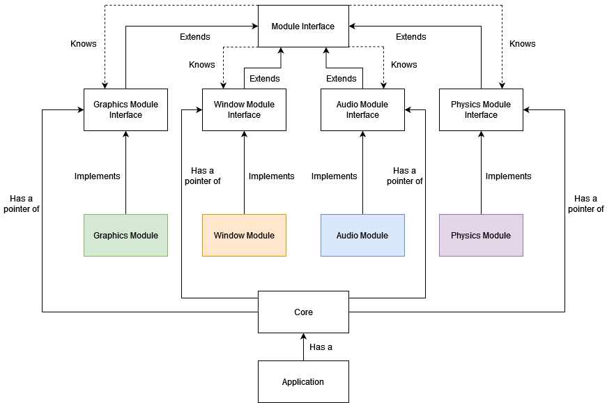
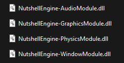
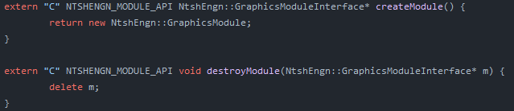
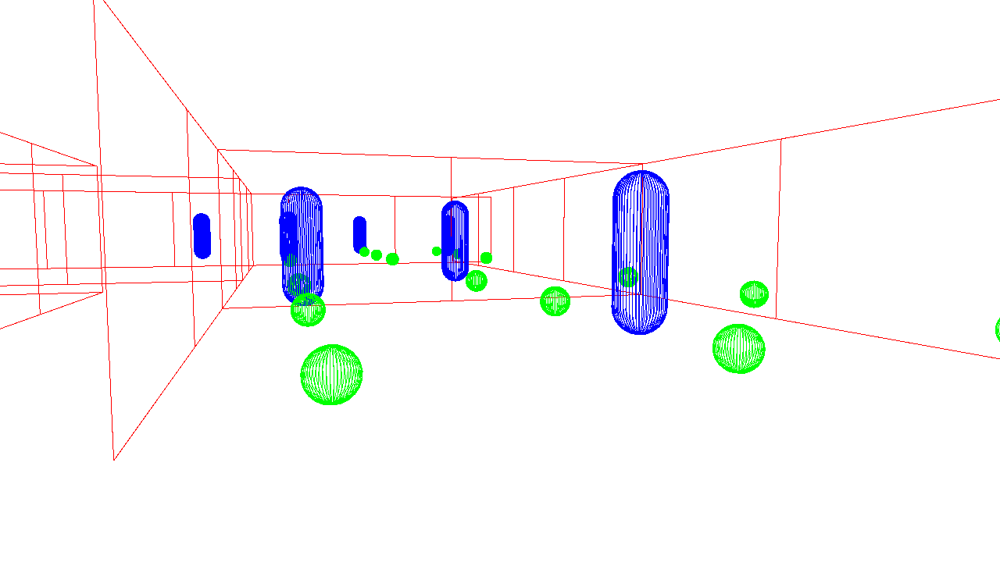
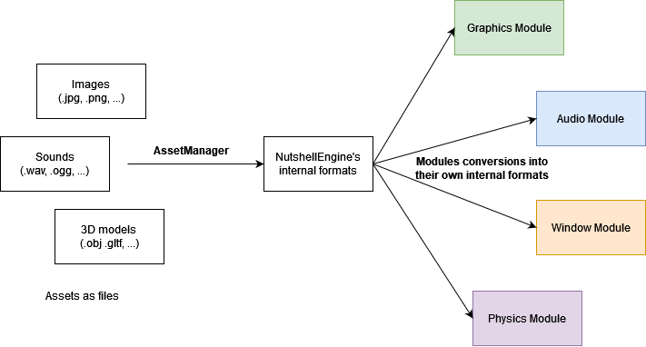

# NutshellEngine, a presentation
[**NutshellEngine**](https://github.com/Team-Nutshell) is a game engine in development since October 2022. It is based on a modular system, where each part of the game engine (graphics, physics, ...) are not statically linked to the core but dynamically loaded at launch.

The will to make a modular game engine comes from a simple observation on my previous works: **"Static" game engines are hard to drastically change.**

The big issue coming from this statement is that it is not trivial to try out new rendering technics, for example, when the engine is static and everything is built at the same time. Another point is that **it is really hard to find a good game engine architecture** and it can be tempting to reuse some elements from a system in another. A modular game engine with dynamically loaded modules does not allow this, as the implementation of each module is not known by the other modules and the core at compile time. It allows for a better systems separation.

Also, the modular approach permits to **start working on a game with placeholder modules while the real modules are being developped**, allowing to strategically parallelize the engine and game's developments.

## The NutshellEngine Architecture

Each module implements its module interface. For example, a [**Graphics Module**](https://github.com/Team-Nutshell/NutshellEngine-GraphicsModule) implements the [**Graphics Module Interface**](https://github.com/Team-Nutshell/NutshellEngine-Common/blob/main/module_interfaces/ntshengn_graphics_module_interface.h). Each interface extends the [**Module Interface**](https://github.com/Team-Nutshell/NutshellEngine-Common/blob/main/module_interfaces/ntshengn_module_interface.h), which defines common functions like ``init``, which is executed once at the launch of the program, ``update``, which is executed once per frame, and ``destroy``, which is executed once at the end of the program (especially used to cleanup resources).

The functions defined for each interface is different and depends on the type of module, for example, the Window Module Interface contains a function to open a new window or to return the state of a keyboard input.

Each module knows all modules, which means that, for example, the Graphics Module can call functions from the Window Module, which is particularly useful when you need to get a window handle to create a surface to present the rendered images to.

The core has the pointer to all modules and has the role to dispatch these pointers, and other useful information, to every module so they can use them.

The application is the only part a game developer or general program developer would need to touch. This is where the scenes are made and where the gameplay scripts are written. The application has access to the core, and can launch the game engine with it.

## The Core's goals
The core is the central part of NutshellEngine. Its roles include loading the modules.

### What are modules and how to load them
As explained, modules are **dynamically loaded**, which means that modules are **dynamic libraries** (*.dll* on Windows, *.lib.so* on Linux, *.dylib* on Mac, even though Mac is not supported yet as I don't have the hardware to test things on).

*Modules on Windows*

Modules are loaded when the application launches, using each OS' function to load dynamic libraries (``LoadLibrary`` on [**Windows**](https://github.com/Team-Nutshell/NutshellEngine-Core/blob/main/src/module_loader/ntshengn_module_loader_windows.h), ``dlopen`` on [**Linux**](https://github.com/Team-Nutshell/NutshellEngine-Core/blob/main/src/module_loader/ntshengn_module_loader_linux.h)). Each module implements a function called ``createModule``, that returns a pointer to the module. NutshellEngine and its modules being written in C++, name mangling, and especially the fact that it is not standardized, is an issue, and global functions with the ``extern "C"`` qualifier are used to tell the compiler to not mangle it. That function is then called from the core to get the pointer to the module. When the application ends, a ``destroyModule`` function is loaded, and is called with the module as parameter to free it.

It could be possible to free the memory from the core using ``delete`` and avoid defining and loading the ``destroyModule`` function, but the way the module's pointer is allocated in the ``createModule`` function is not standardized and allows the use of custom allocators.

*A simple example of ``createModule`` and ``destroyModule`` functions*

The implementation of the module's interface is completely dependant on the developer and the modules are designed to be as free as possible in term of external libraries the developer wants to use. For example, the Graphics Modules do not depend on any graphics API at all, for example, [**``vulkan-triangle``**](https://github.com/Team-Nutshell/NutshellEngine-GraphicsModule/tree/module/vulkan-triangle) uses Vulkan and [**``directx12-triangle``**](https://github.com/Team-Nutshell/NutshellEngine-GraphicsModule/tree/module/directx12-triangle) uses Direct3D 12 and both can be swapped with each other without modifying anything as the other modules and the core do not care about how things are implemented.

### A central part
After the core loaded the modules, its role is to dispatch some information to all modules. These information are the other modules' pointers, the ECS and the Asset Manager, which we will both see later.

Then, it has to run the gameloop and call the modules' ``init``, ``update`` and ``destroy`` functions.

### Gameplay scripting
A game engine needs a way to allow scripting, which gives behaviours to objects in the game. The scripting system is really close to the modules, but is not one (at the moment, it may change in the future if the need appears).

The scripting supports C++ scripting, these scripts being written in the application and compiled with the application. For example, we can [**write a script to move the camera in the world**](https://github.com/Team-Nutshell/NutshellEngine-Application/blob/application/camera-first-person/scripts/camerascript.h).

These scripts have three pre-defined functions to implement: ``init``, called once at the script's creation, ``update``, called once per frame, and ``destroy``, called once at the object's destruction. These receive the same information as the modules so they can call the modules' functions, and more.

## Entity-Component-System, the link between the application and the modules
An ECS (Entity-Component-System) is used to communicate information between the application and the modules. It is based on [*A Simple Entity Component System* by *Austin Morlan*](https://austinmorlan.com/posts/entity_component_system/) but has been heavily modified and, for example, allows the usage of callbacks in the systems when a interesting Component is added to an Entity.

Each module is a System and is registered as such after being loaded. Each module can also implement the function ``getComponentMask`` and return the components this module is interested in. For example, a Graphics Module may need to know when an entity as a Renderable component to render it on screen. In that case, when an entity gets a Renderable component, a callback is called in the Graphics Module to manage it directly.

The reason why module developers can chose which Components their module will need, instead of using a fixed list (for example, Renderable, Camera and Light for Graphics Module), is to allow a maximum of flexibility in the usage of modules.

For example, the [**``vulkan-collider``**](https://github.com/Team-Nutshell/NutshellEngine-GraphicsModule/tree/module/vulkan-collider) Graphics Module allows to see and debug the colliders and intersections calculations, by requiring the **AABBCollider**, **SphereCollider** and **CapsuleCollider** components.

*The ``vulkan-collider`` Graphics Module*

## The AssetManager
The AssetManager stores assets in an internal format used by NutshellEngine (for examples, [**for images and 3D models**](https://github.com/Team-Nutshell/NutshellEngine-Common/blob/main/resources/ntshengn_resources_graphics.h)).

The AssetManager can load assets from files (*.jpg*, *.png* and others for images for example) or provide completely empty assets that can be filled with code. These assets are then into NutshellEngine's internal formats. These assets can then be linked to some Components (the Renderable component uses ``NtshEngn::Mesh`` for 3D meshes and ``NtshEngn::Material`` for materials, which uses ``NtshEngn::Image`` for textures) and read in the modules into their own internal formats, which is decided by the module's developer.

## Making games
Two real games have been made with NutshellEngine at the time this post is written:

The first one is [**The Girl Near The Window**](https://ntsh-oni.itch.io/the-girl-near-the-window), a little 3D game shipped with the [**``glfw``**](https://github.com/Team-Nutshell/NutshellEngine-WindowModule/tree/module/glfw) Window Module, the [**``openal-soft``**](https://github.com/Team-Nutshell/NutshellEngine-AudioModule/tree/module/openal-soft) Audio Module, a modified [**``vulkan-ecs``**](https://github.com/Team-Nutshell/NutshellEngine-GraphicsModule/tree/module/vulkan-ecs) Graphics Module, and a closed source Physics Module (closed at the moment this post is written, it is not yet open source as it is not finished).

The second one is [**The Origin of Light**](https://ntsh-oni.itch.io/the-origin-of-light-ggj-2023), made in 48 hours during Global Game Jam 2023. It uses the same modules as *The Girl Near The Window* excepted for the Graphics Module with is a modified version of [**``vulkan-raymarching``**](https://github.com/Team-Nutshell/NutshellEngine-GraphicsModule/tree/module/vulkan-raymarching), as this game is completely raymarched and does not use any mesh or texture.

Even though these games are shipped with these modules, they can be swapped with other modules if needed, and neither the core nor the game needs to be recompiled, as demonstrated in this video:

*Module swapping in The Girl Near The Window*

## The Future
The engine is still early in its development but already allows to develop robust applications. As I am alone on this project at the moment, its pace of advancement is variable but pretty fluid since October 2022.

Some things are still missing to consider NutshellEngine to be in its 1.0 version:
- **Module specification**: This point is really important as the specification will allow to give precise directions on how to implement every functions in the modules interfaces. It could be done now but as things are still moving very fast, it is preferable to consider all interfaces as ready for 1.0 before writing the specification.
- **File management**: Assets and scenes still need to be defined and packed efficiently.
- **GUI**: An editor would help a lot in editing the scenes and their entities with components. It is planned and is being specified.
- **More modules examples**: Every module needs more bases to start upon and more examples of finished modules to be used directly.

## Contribute
NutshellEngine is available on [**TeamNutshell's GitHub**](https://github.com/Team-Nutshell) under the MIT licence.

It is composed of multiple repositories:
- [**NutshellEngine-Application**](https://github.com/Team-Nutshell/NutshellEngine-Application): Applications and examples using NutshellEngine.
- [**NutshellEngine-Core**](https://github.com/Team-Nutshell/NutshellEngine-Core): The core of the engine.
- [**NutshellEngine-Common**](https://github.com/Team-Nutshell/NutshellEngine-Common): The common parts used in the modules and the core.
- [**NutshellEngine-Module**](https://github.com/Team-Nutshell/NutshellEngine-Module): The common parts used in the modules only.
- [**NutshellEngine-GraphicsModule**](https://github.com/Team-Nutshell/NutshellEngine-GraphicsModule): The base Graphics Module and examples.
- [**NutshellEngine-WindowModule**](https://github.com/Team-Nutshell/NutshellEngine-WindowModule): The base Window Module and examples.
- [**NutshellEngine-AudioModule**](https://github.com/Team-Nutshell/NutshellEngine-AudioModule): The base Audio Module and examples.
- [**NutshellEngine-PhysicsModule**](https://github.com/Team-Nutshell/NutshellEngine-PhysicsModule): The base Physics Module and examples.

It is possible to report issues or ideas of improvements using the ``Issues`` part of each repository and propose changes using the ``Pull requests`` part of each repository.