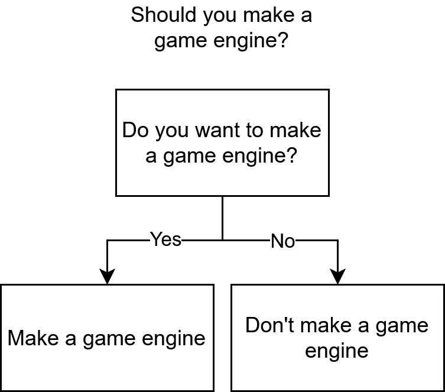

# Starting game engine development
A game engine is a pretty big piece of technology and if you want to make one, it can be really hard to understand where you should start. There are multiple ways to start and this article will only take in count my personal experience, with what worked and what didn't.

## Should you make a game engine?
Let's start with the basis: **Should you make a game engine?**

To answer this question, I made a chart that should help you make a decision:

Honestly, unless you want to ship a game *fast*, what only matters is if you want to do it or not. Making a game engine, and even if you don't even know what kind of games you are going to do with it, and even if you don't plan to make any games on it *yet*, is a great learning experience on various domains: **software architecture**, **programming**, **mathematics**, **physics**, **computer graphics**, **audio**, etc. It is a really versatile domain, which makes it really interesting.

## Prerequisite
Even if I definitely think that **everyone can make a game engine**, I feel that there is at least **one** prerequisite you need before starting.

**Knowing a programming language.**

Whatever this programming language is, C++, Java, Python, or whatever else, you need to be really familiar with a programming language before starting to work on a game engine or the experience will get really painful and frustrating, as you will have learn both the programming language and how to make all the systems in a game engine at the same time. 

**You don't need to be an expert in your language** but **you should at least be able to program painlessly with it**.

## A marathon, not a sprint
Game engine development is a huge topic, and **there are 99% chances that your first game engine won't be good**. And it is okay, because with the experience you gained with the first engine, you will make a second one, that will also not be good. And it is still okay, the third one will probably start to be interesting.

If you wonder why I am talking about multiple engines and not just a single one that you update *ad vitam aeternam*, it's because one **crucial** thing that will make-or-break your engine, and especially your capacity to continuously update and refactor it is its **architecture**.

## Engine architecture
Architecturing a software is **thinking on how each system interact with each other** and basically how some data from system A will be read/written by system B. For example: You need a **window** to draw on it, how do you get this window? Do you create it in the renderer? Do you create a system just to manage your window, and if so, how do you create the render surface from there? Do you create it in this window system? Do you pass information about your window to your renderer and let the renderer create the surface? There are **many questions of this type** that you will have to answer when making your game engine. In your first engine, you will make wrong choices, and it's completely normal and fine, and by making these mistakes, you will learn why your choice was wrong and how you can improve it. Sometimes, you can improve it in the same engine with some amount of refactoring, sometimes, it's too late to go back and it's better to start again.

So, how do you think about your first game engine architecture? I would say that thinking too hard about it at the start won't work well, because you need to know what actually happens in a game engine to be able to architecture it correctly. I could tell you to read all the 1200 pages of *Game Engine Architecture* by Jason Gregory before making your first game engine but, even if it is a **great book** that I advise you to consult at some point, the lack of practice and the overwhelming information about unknown topics won't help you at all.

## It's time to start
So **how should you start making a game engine**?

Some people **advise to make a game from scratch and extract the common parts**. It's a good way to enter the game engine development field, but if you have no idea what kind of game to make, I would advise to take **the one topic you are the most interested in game engines**, this can be **rendering**, **physics** or **audio**, and build an engine **only** around this topic first.

I will take the graphics engine as an example as it is my main topic.

### The first game engine
If you start with a graphics engine, **the choice of the API does matter on your learning journey**. I started with Vulkan, so understanding the API was a big part of my first game engine, but if you are okay to make it a little bit easier by using something less modern, OpenGL is a great choice to start. You can basically reimplement [**Learn OpenGL**](https://learnopengl.com/) (even if you didn't chose OpenGL! Everything will work on any API) to learn the basis of real-time computer graphics and learn your first rendering technics like lighting, shadow mapping, skybox, etc. The main goal here is to avoid learning all the systems in a game engine at the same time, but **focus on one big topic**, before starting to work on another one.

While working on your graphics engine, at one point, you will need to **move the camera**, which will be your introduction to **scripting** and **input management**, which will make you realize multiple things, like the importance of having the delta time in scripts to be independant of the framerate, or how keyboard and mouse button inputs can be compared to state machines. When you will program your camera, you will be in the shoes of a game developer that will also develop a camera on your game engine, and when you will use your camera, you will be in the shoes of a player that will play a game made on your game engine.

You maybe want some sounds now, so you can use something like [**OpenAL Soft**](https://github.com/kcat/openal-soft) and start playing sounds in your program. You don't even have to go deep, just understanding how sounds are played will help you for later.

You can even go as far as having rigidbody physics, either with a library like [**Jolt**](https://github.com/jrouwe/JoltPhysics) or by doing the math yourself. You will understand that some objects must be affected by physics, but others don't, and that will force you to find a solution to separate these two kinds of objects.

And at some point, you will feel stucked by your engine. It can happen after a few months or even a few years. Too hard and tedious to add new features, but also too complicated to refactor. This will be the breaking point of your first game engine and the moment to say goodbye, but it's for the better, because it's now time to start working on the second one!

### The next game engines
If it can reassure you, **the next game engines won't take you as long to have the same set of features as the previous ones**.

**You now have some experience**, you tried multiple things, some worked, some didn't, it's time **to reflect on this**. If you started with OpenGL, **do you still not want to go with something more modern like Vulkan or Direct3D 12** this time? Even if your only goal is to learn and not use the modern features like raytracing and mesh shaders, it can be interesting to do. You probably hardcoded a camera, but if you think about the games you potentially want to see made with your game engine, you maybe want to be able to use 2 or 3 cameras, or even 0 at some point. Have you correctly defined what an "Object" is yet? Those are the kind of questions you must ask yourself before starting to write the first line of code of your new engine. **Use a paper, draw things**, but get a clearer idea on what you are going to do.

Architecturally, there are **really high chances that your first engine was a mess**, especially if it was oriented around one topic (like the graphics engine). Having a **distinct split between each system**, so you don't have part of the physics engine in the renderer class for example, will help you a lot when you want to extend or refactor a system in particular. With the experience you gained with the first game engine, **you now have a broader view on what is a game engine, what systems it has and how these systems interract between them**. Use this experience and the mistakes of the first engine to completely change how your engine is architectured. You can, for example, use an Entity-Component-System (ECS), where each of the engine's system are Systems (so the renderer, the physics engine, the audio engine, the window and inputs, etc.) that are interested in some Components (the renderer is interested in renderable objects, lights and cameras, the physics system is interested in rigidbodies, etc.).

You can even **design your game engine around its ability to be easily refactorable**. This was NutshellEngine's main design decision, I know I wanted to learn a lot of things on this engine, so I splitted each system in a dynamic library and if I want to replace a system, for example, make a new renderer, I have absolutely no refactoring to do, I simply create another dynamic library with the graphics system's interface. Dynamic libraries have other advantages, and a lot of disadvantages, but it's a topic for another time.

**Can your game engine even make games?** Can you program some gameplay in it and then export the final result and have someone else play it? Even if you are personally not interested in making games, and only interested in the technical part of it, being able to actually make games is an important technical part of a game engine but it is really easy to forget it, especially as you will work with small test scenes 99% of the time. **Make games with it**. I won't enter into too much details as [I already wrote an article about it](https://www.team-nutshell.dev/nutshellengine/articles/making-games-during-development.html), but making games while developing a game engine is a really important thing to do.