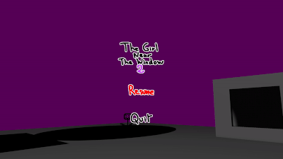

# Developing a game for Steam while developing a game engine, and vice-versa
I have made **multiple small and short games** with NutshellEngine since the development started in September 2022. Generally, I either had a small idea that I decided to do in a few days, or I participated in game jams, where I also had a few days to make a game, but in both cases, these were small games, not made to be sold, only to be posted and shared in small groups.

In October 2024, I had an idea for a game that would be **more complicated and longer to make** that what I usually do with NutshellEngine. I worked a little bit on it but it's not before March 2025 that I decided to consider NutshellEngine stable enough to make a commercial game with it, and **to pause its development and focus entirely on the game**.

At the moment, I didn't realize **how wrong I was**.

## Evolving the engine with the game, and the game with the engine
Contrary to what I expected, NutshellEngine's development **didn't slow down at all**, it even **accelerated on some parts**, as this new game needed new features and bug fixes.

**Making a commercial game** is not like posting something made in a few days for free, at least in my opinion, it requires dedication and rigor to deliver something that is good to play and worth the money. This includes **fixing long standing "minor" issues** that weren't really important to me before.

For example, in the previous games I made with NutshellEngine, Alt-Tabbing and losing the focus of the window would free the mouse cursor, which made the camera spin really quickly. This issue would need to be able to detect when the window loses focus, which was not implemented at this time, as I didn't consider it to be important enough and had more pressing things to do. Now, this is a bug that I cannot keep in a commercial game with a longer development time, so it is now possible to know if the window is focused, and the camera is not spinning anymore.

*The camera spinning when losing window focus in [The Girl Near The Window 2](ntsh-oni.itch.io/the-girl-near-the-window-2)*

I also discovered **some performance issues**, especially with the way the octree was built during the broadphase of collisions detection in the physics engine, this was not found before because **the scenes were way smaller**, with less rigidbodies than what I would need for this game.

But the runtime is not the only part of the engine that received improvements, **the editor has also been greatly improved**. Working on bigger scenes implied that I needed better ways to get from one point of the map to another when editing them. In general, the editor received a lot of quality-of-life improvements, like being able to directly teleport to an entity with a single key, mass-renaming of entities, being able to fix the size of gizmos independently of the distance with the camera, and many others improvements that I did not need before making a game bigger than the ones before.

## Steam integration
**Steam integration** is also something I would not have done if I didn't want to put a game on Steam. I decided to include it "directly" in the engine, as a module (a dynamic library, like what the graphics engine, physics engine, etc. already are).

It was actually **way easier than what I expected**, even though I have not implemented everything that the Steamworks API proposes, I have some basic functionalities, and especially the ones I need for this game, like being able to **unlock achievements**.

Basically, you need the **Steamworks SDK**, call [SteamAPI_Init](https://partner.steamgames.com/doc/api/steam_api#SteamAPI_Init) at the start, [SteamAPI_Shutdown](https://partner.steamgames.com/doc/api/steam_api#SteamAPI_Shutdown) at the end, and [SteamAPI_RunCallbacks](https://partner.steamgames.com/doc/api/steam_api#SteamAPI_RunCallbacks) every frame. Then depending on what you need, the documentation is pretty clear. Just be aware that for achievements, the documentation says that you need to call [RequestCurrentStats](https://partner.steamgames.com/doc/api/ISteamUserStats#RequestCurrentStats) before everything else, but it looks like that this function does not exist anymore, so you don't actually have to call it (example: [SetAchievement](https://partner.steamgames.com/doc/api/ISteamUserStats#SetAchievement)).

The editor has also been updated to be able to **export a game directly for Steam**, by allowing the user **to specify the Steam AppID** of the game and including the right Steam API dynamic library (*steam_api64.dll* for Windows or *libsteam_api.so* for Linux) and NutshellEngine's Steam platform module during export.

## Conclusion
Making a commercial game for Steam was **not the moment to pause the engine's development** as I expected, but was actually a great occasion to fix long standing issues and adding features that would be necessary to make a bigger game than what I used to do for game jams.

We have the possibility to fix the issues we have in a game engine, so let's take advantage of it!

<iframe src="https://store.steampowered.com/widget/3939010/" frameborder="0" width="646" height="190"></iframe>