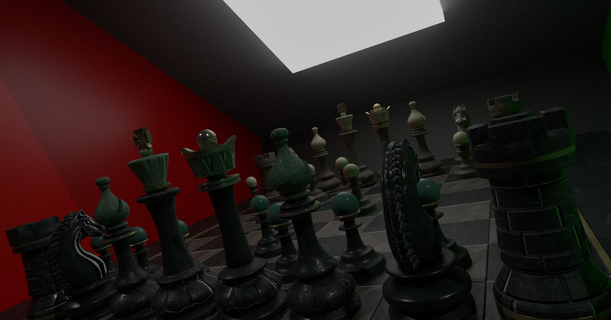
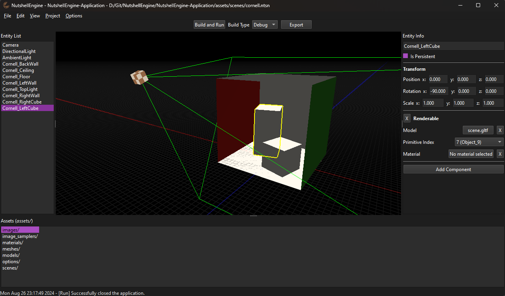

[**NutshellEngine**](https://github.com/Team-Nutshell) is a modular game engine designed to enable game and engine developers to work together efficiently by providing easy to replace modules implementing the game engine's principal systems such as rendering, physics and audio.
- [**NutshellEngine**](https://github.com/Team-Nutshell/NutshellEngine): Core of NutshellEngine, manages the modules and various systems.
- [**Application**](https://github.com/Team-Nutshell/NutshellEngine-Application): Base of NutshellEngine's applications.
- [**Editor**](https://github.com/Team-Nutshell/NutshellEngine-Editor): NutshellEngine's editor.
- [**Graphics Module**](https://github.com/Team-Nutshell/NutshellEngine-GraphicsModule): Module managing NutshellEngine's graphics engine.
- [**Physics Module**](https://github.com/Team-Nutshell/NutshellEngine-PhysicsModule): Module managing NutshellEngine's physics engine.
- [**Window Module**](https://github.com/Team-Nutshell/NutshellEngine-WindowModule): Module managing NutshellEngine's windows and inputs.
- [**Audio Module**](https://github.com/Team-Nutshell/NutshellEngine-AudioModule): Module managing NutshellEngine's audio system.
- [**Asset Loader Module**](https://github.com/Team-Nutshell/NutshellEngine-AssetLoaderModule): Module loading assets used by NutshellEngine's applications and modules.

NutshellEngine features:
- Swappable modules without recompiling the application;
- C++ entity scripting (with a [ScriptingAPI](../nutshellengine-docs/scripting/api/index.html) documentation);
- Job system for multithreading;
- Networking abstraction;
- Assets (images, models, sounds, scenes, ...) management system;
- User Interface API.

## [Documentation](../nutshellengine-docs)

## [Modules](modules/index.md)

## [Games made with NutshellEngine](games/index.md)

## Articles
- [**On the importance to make games during the game engine's development**](articles/making-games-during-development.md)
- [**Vulkan: VkRenderPass VS Dynamic Rendering**](articles/vulkan-renderpass.md)
- [**NutshellEngine's 1st anniversary!**](articles/1stanniversary.md)
- [**Mistakes will be made**](articles/mistakes.md)
- [**Colliders, intersection normal and penetration depth**](articles/colliders.md)
- [**NutshellEngine, a presentation**](articles/presentation.md)

## Screenshots
 

